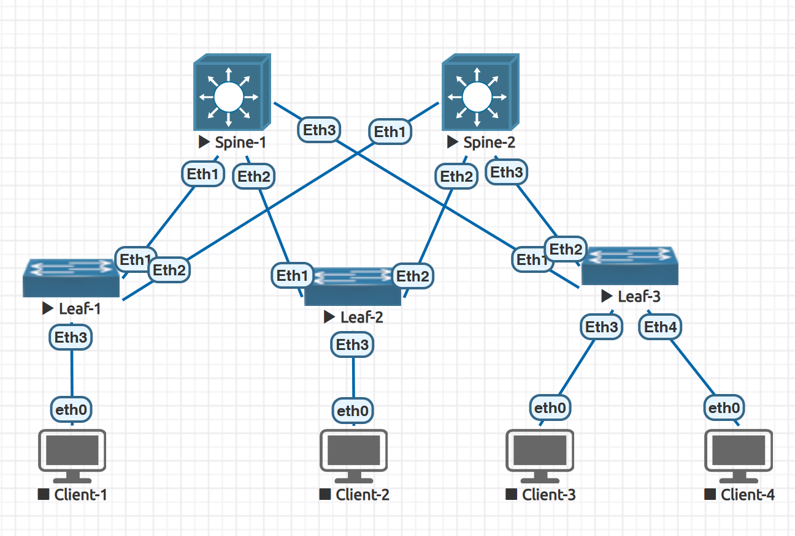

### Проектирование адресного пространства

### Цели
- Собрать схему CLOS;
- Распределить адресное пространство;


### Подготовка стенда



### Таблица адресов


|Device|Interface|IP Address|Subnet Mask|Description
|---|---|---|---|---|
spine-1|loopback0|10.60.0.1|255.255.255.255|N/A
spine-2|loopback0|10.60.0.2|255.255.255.255|N/A
leaf-1|loopback0|10.60.1.1|255.255.255.255|N/A
leaf-2|loopback0|10.60.1.2|255.255.255.255|N/A
leaf-3|loopback0|10.60.1.3|255.255.255.255|N/A


P-t-P links
10.60.2.0/30 leaf-1 - spine-1
10.60.2.4/30 leaf-1 - spine-2
10.60.2.8/30 leaf-2 - spine-1
10.60.2.12/30 leaf-2 - spine-2
10.60.2.16/30 leaf-3 - spine-1
10.60.2.20/30 leaf-3 - spine-2

Clients Network
10.70.0.0/22

#### Настройка Leaf-1

```
en
zerotouch disable
conf t
hostname leaf-1
int eth1
no switchport
description #To-Spine-1
ip address 10.60.2.1 255.255.255.252
exit
int eth2
no switchport
description #To-Spine-2
ip address 10.60.2.5 255.255.255.252
exit
int loopback 0
ip address 10.60.1.1 255.255.255.255
end
leaf-1#sh int status
Port       Name        Status       Vlan     Duplex Speed  Type            Flags Encapsulation
Et1        #To-Spine-1 connected    routed   full   1G     EbraTestPhyPort
Et2        #To-Spine-2 connected    routed   full   1G     EbraTestPhyPort
Et3                    connected    1        full   1G     EbraTestPhyPort
Et4                    connected    1        full   1G     EbraTestPhyPort
Et5                    connected    1        full   1G     EbraTestPhyPort
Et6                    connected    1        full   1G     EbraTestPhyPort
Et7                    connected    1        full   1G     EbraTestPhyPort
Et8                    connected    1        full   1G     EbraTestPhyPort
Ma1                    connected    routed   a-full a-1G   10/100/1000

leaf-1#
leaf-1#sh ip int br
                                                                        Address
Interface        IP Address        Status      Protocol          MTU    Owner
---------------- ----------------- ----------- ------------- ---------- -------
Ethernet1        10.60.2.1/30      up          up               1500
Ethernet2        10.60.2.5/30      up          up               1500
Loopback0        10.60.1.1/32      up          up              65535
Management1      unassigned        up          up               1500
wr
```

#### Настройка Leaf-2

```
en
zerotouch disable
conf t
hostname leaf-2
int eth1
no switchport
description #To-Spine-1
ip address 10.60.2.9 255.255.255.252
exit
int eth2
no switchport
description #To-Spine-2
ip address 10.60.2.13 255.255.255.252
exit
int loopback 0
ip address 10.60.1.2 255.255.255.255
end
leaf-2#sh int status
Port       Name        Status       Vlan     Duplex Speed  Type            Flags Encapsulation
Et1        #To-Spine-1 connected    routed   full   1G     EbraTestPhyPort
Et2        #To-Spine-2 connected    routed   full   1G     EbraTestPhyPort
Et3                    connected    1        full   1G     EbraTestPhyPort
Et4                    connected    1        full   1G     EbraTestPhyPort
Et5                    connected    1        full   1G     EbraTestPhyPort
Et6                    connected    1        full   1G     EbraTestPhyPort
Et7                    connected    1        full   1G     EbraTestPhyPort
Et8                    connected    1        full   1G     EbraTestPhyPort
Ma1                    connected    routed   a-full a-1G   10/100/1000

leaf-2#
leaf-2#sh ip int br
                                                                        Address
Interface       IP Address         Status      Protocol          MTU    Owner
--------------- ------------------ ----------- ------------- ---------- -------
Ethernet1       10.60.2.9/30       up          up               1500
Ethernet2       10.60.2.13/30      up          up               1500
Loopback0       10.60.1.2/32       up          up              65535
Management1     unassigned         up          up               1500
wr
```

#### Настройка Leaf-3

```
en
zerotouch disable
conf t
hostname leaf-3
int eth1
no switchport
description #To-Spine-1
ip address 10.60.2.17 255.255.255.252
exit
int eth2
no switchport
description #To-Spine-2
ip address 10.60.2.21 255.255.255.252
exit
int loopback 0
ip address 10.60.1.3 255.255.255.255
end
leaf-3#sh int status
Port       Name        Status       Vlan     Duplex Speed  Type            Flags Encapsulation
Et1        #To-Spine-1 connected    routed   full   1G     EbraTestPhyPort
Et2        #To-Spine-2 connected    routed   full   1G     EbraTestPhyPort
Et3                    connected    1        full   1G     EbraTestPhyPort
Et4                    connected    1        full   1G     EbraTestPhyPort
Et5                    connected    1        full   1G     EbraTestPhyPort
Et6                    connected    1        full   1G     EbraTestPhyPort
Et7                    connected    1        full   1G     EbraTestPhyPort
Et8                    connected    1        full   1G     EbraTestPhyPort
Ma1                    connected    routed   a-full a-1G   10/100/1000

leaf-3#
leaf-3#sh ip int br
                                                                        Address
Interface       IP Address         Status      Protocol          MTU    Owner
--------------- ------------------ ----------- ------------- ---------- -------
Ethernet1       10.60.2.17/30      up          up               1500
Ethernet2       10.60.2.21/30      up          up               1500
Loopback0       10.60.1.3/32       up          up              65535
Management1     unassigned         up          up               1500
wr
```

#### Настройка Spine-1

```
en
zerotouch disable
conf t
hostname spine-1
int eth1
no switchport
description #To-Leaf-1
ip address 10.60.2.2 255.255.255.252
exit
int eth2
no switchport
description #To-Leaf-2
ip address 10.60.2.10 255.255.255.252
exit
int eth3
no switchport
description #To-Leaf-3
ip address 10.60.2.18 255.255.255.252
exit
int loopback 0
ip address 10.60.0.1 255.255.255.255
end
spine-1#sh int status
Port       Name       Status       Vlan     Duplex Speed  Type            Flags Encapsulation
Et1        #To-Leaf-1 connected    routed   full   1G     EbraTestPhyPort
Et2        #To-Leaf-2 connected    routed   full   1G     EbraTestPhyPort
Et3        #To-Leaf-3 connected    routed   full   1G     EbraTestPhyPort
spine-1#sh ip int br
                                                                        Address
Interface       IP Address         Status      Protocol          MTU    Owner
--------------- ------------------ ----------- ------------- ---------- -------
Ethernet1       10.60.2.2/30       up          up               1500
Ethernet2       10.60.2.10/30      up          up               1500
Ethernet3       10.60.2.18/30      up          up               1500
Loopback0       10.60.0.1/32       up          up              65535
Management1     unassigned         up          up               1500

```

#### Настройка Spine-2

```
en
zerotouch disable
conf t
hostname spine-2
int eth1
no switchport
description #To-Leaf-1
ip address 10.60.2.6 255.255.255.252
exit
int eth2
no switchport
description #To-Leaf-2
ip address 10.60.2.14 255.255.255.252
exit
int eth3
no switchport
description #To-Leaf-3
ip address 10.60.2.22 255.255.255.252
exit
int loopback 0
ip address 10.60.0.2 255.255.255.255
end
spine-2#sh int status
Port       Name       Status       Vlan     Duplex Speed  Type            Flags Encapsulation
Et1        #To-Leaf-1 connected    routed   full   1G     EbraTestPhyPort
Et2        #To-Leaf-2 connected    routed   full   1G     EbraTestPhyPort
Et3        #To-Leaf-3 connected    routed   full   1G     EbraTestPhyPort
Et4                   connected    1        full   1G     EbraTestPhyPort
Et5                   connected    1        full   1G     EbraTestPhyPort
Et6                   connected    1        full   1G     EbraTestPhyPort
Et7                   connected    1        full   1G     EbraTestPhyPort
Et8                   connected    1        full   1G     EbraTestPhyPort
Ma1                   connected    routed   a-full a-1G   10/100/1000

spine-2#
spine-2#sh ip int br
                                                                        Address
Interface       IP Address         Status      Protocol          MTU    Owner
--------------- ------------------ ----------- ------------- ---------- -------
Ethernet1       10.60.2.6/30       up          up               1500
Ethernet2       10.60.2.14/30      up          up               1500
Ethernet3       10.60.2.22/30      up          up               1500
Loopback0       10.60.0.2/32       up          up              65535
Management1     unassigned         up          up               1500
wr

```

