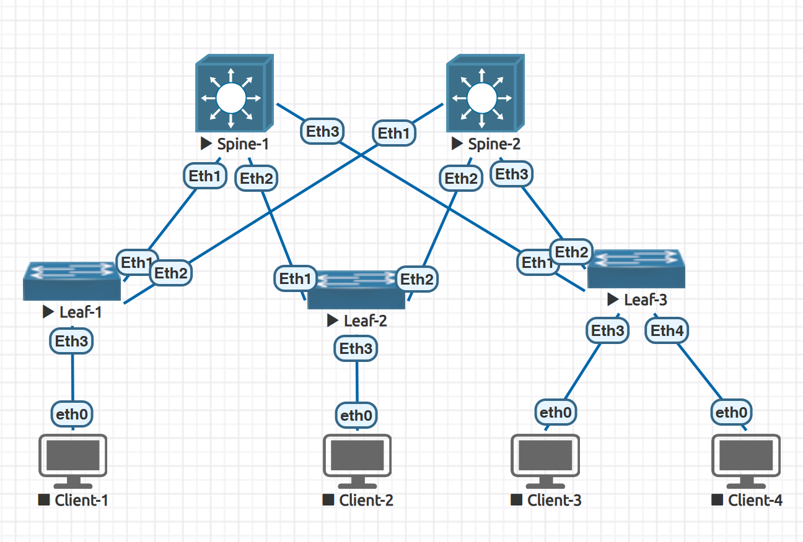

### Underlay. OSPF

### Цели
- Настроите OSPF в Underlay сети, для IP связанности между всеми сетевыми устройствами;
- Зафиксируете в документации - план работы, адресное пространство, схему сети, конфигурацию устройств;
- Убедитесь в наличии IP связанности между устройствами в OSFP домене;


### Общая топология




#### Настройка Spine-1

```
spine-1(config)#ip routing
spine-1(config)#router ospf 10
spine-1(config-router-ospf)#router-id 10.60.0.1
spine-1(config-router-ospf)#log-adjacency-changes
spine-1(config-router-ospf)#passive-interface default
spine-1(config-router-ospf)#no passive-interface Eth1
spine-1(config-router-ospf)#no passive-interface Eth2
spine-1(config-router-ospf)#no passive-interface Eth3
spine-1(config-router-ospf)#network 10.60.0.1 0.0.0.0 area 0
spine-1(config-router-ospf)#network 10.60.2.0 0.0.0.3 area 0
spine-1(config-router-ospf)#network 10.60.2.8 0.0.0.3 area 0
spine-1(config-router-ospf)#network 10.60.2.16 0.0.0.3 area 0
spine-1(config)#interface Eth1
spine-1(config-if-Et1)#ip ospf network point-to-point
spine-1(config-if-Et1)#bfd interval 100 min_rx 100 multiplier 3
spine-1(config-if-Et1)#no bfd echo
spine-1(config)#interface Eth2
spine-1(config-if-Et2)#ip ospf network point-to-point
spine-1(config-if-Et2)#bfd interval 100 min_rx 100 multiplier 3
spine-1(config-if-Et2)#no bfd echo
spine-1(config)#interface Eth3
spine-1(config-if-Et3)#ip ospf network point-to-point
spine-1(config-if-Et3)#bfd interval 100 min_rx 100 multiplier 3
spine-1(config-if-Et3)#no bfd echo

spine-1#sh running-config | sec ospf
router ospf 10
   passive-interface default
   no passive-interface Ethernet1
   no passive-interface Ethernet2
   no passive-interface Ethernet3
   network 10.60.0.1/32 area 0.0.0.0
   network 10.60.2.0/30 area 0.0.0.0
   network 10.60.2.8/30 area 0.0.0.0
   network 10.60.2.16/30 area 0.0.0.0
   max-lsa 12000
```

#### Настройка Spine-2

```
spine-2(config)#
ip routing
interface Eth1
ip ospf network point-to-point
bfd interval 100 min_rx 100 multiplier 3
no bfd echo

interface Eth2
ip ospf network point-to-point
bfd interval 100 min_rx 100 multiplier 3
no bfd echo

interface Eth3
ip ospf network point-to-point
bfd interval 100 min_rx 100 multiplier 3
no bfd echo

router ospf 10
router-id 10.60.0.2
log-adjacency-changes
passive-interface default
no passive-interface Eth1
no passive-interface Eth2
no passive-interface Eth3
network 10.60.0.2 0.0.0.0 area 0
network 10.60.2.4 0.0.0.3 area 0
network 10.60.2.12 0.0.0.3 area 0
network 10.60.2.20 0.0.0.3 area 0
```

#### Настройка Leaf-1

```
leaf-1(config)#
ip routing

interface Eth1
ip ospf network point-to-point
bfd interval 100 min_rx 100 multiplier 3
no bfd echo

interface Eth2
ip ospf network point-to-point
bfd interval 100 min_rx 100 multiplier 3
no bfd echo

router ospf 10
router-id 10.60.1.1
log-adjacency-changes
passive-interface default
no passive-interface Eth1
no passive-interface Eth2
network 10.60.1.1 0.0.0.0 area 0
network 10.60.2.0 0.0.0.3 area 0
network 10.60.2.4 0.0.0.3 area 0

```

#### Настройка Leaf-2

```
leaf-2(config)#
ip routing

interface Eth1
ip ospf network point-to-point
bfd interval 100 min_rx 100 multiplier 3
no bfd echo

interface Eth2
ip ospf network point-to-point
bfd interval 100 min_rx 100 multiplier 3
no bfd echo

router ospf 10
router-id 10.60.1.2
log-adjacency-changes
passive-interface default
no passive-interface Eth1
no passive-interface Eth2
network 10.60.1.2 0.0.0.0 area 0
network 10.60.2.8 0.0.0.3 area 0
network 10.60.2.12 0.0.0.3 area 0

```

#### Настройка Leaf-3

```
leaf-3(config)#

ip routing
interface Eth1
ip ospf network point-to-point
bfd interval 100 min_rx 100 multiplier 3
no bfd echo

interface Eth2
ip ospf network point-to-point
bfd interval 100 min_rx 100 multiplier 3
no bfd echo

router ospf 10
router-id 10.60.1.3
log-adjacency-changes
passive-interface default
no passive-interface Eth1
no passive-interface Eth2
network 10.60.1.3 0.0.0.0 area 0
network 10.60.2.16 0.0.0.3 area 0
network 10.60.2.20 0.0.0.3 area 0

```


#### Проверка установленного соседства

```
spine-1#
sh ip ospf neighbor
Neighbor ID     Instance VRF      Pri State                  Dead Time   Address         Interface
10.60.1.1       10       default  1   FULL                   00:00:35    10.60.2.1       Ethernet1
10.60.1.2       10       default  1   FULL                   00:00:36    10.60.2.9       Ethernet2
10.60.1.3       10       default  0   FULL                   00:00:36    10.60.2.17      Ethernet3

spine-2#
sh ip ospf neighbor
Neighbor ID     Instance VRF      Pri State                  Dead Time   Address         Interface
10.60.1.1       10       default  0   FULL                   00:00:35    10.60.2.5       Ethernet1
10.60.1.2       10       default  0   FULL                   00:00:35    10.60.2.13      Ethernet2
10.60.1.3       10       default  0   FULL                   00:00:37    10.60.2.21      Ethernet3

```

