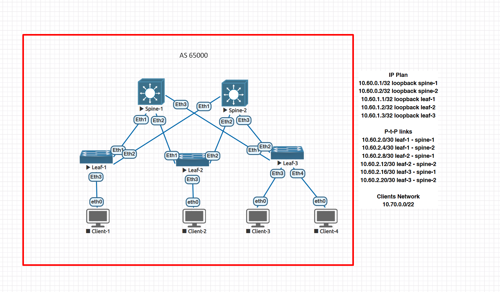

### Underlay. BGP

### Цели
- Настроить BGP для Underlay сети;
- Зафиксируете в документации - план работы, адресное пространство, схему сети, конфигурацию устройств;
- Убедитесь в наличии IP связанности между устройствами в BGP домене;


### Общая топология




### BGP-соседство между Leaf и Spine
- Используется протокол iBGP (все устройства в одной AS).
- Коммутаторы Spine и Leaf обмениваются маршрутами напрямую.
- Loopback-интерфейсы используются в качестве источников BGP-сессий.
- Между Spine и Leaf уже настроен IP-роутинг (OSPF).
- Каждый Leaf устанавливает BGP-сессии со всеми Spine-узлами.
- Spine-узлы выступают как Route Reflectors (RR), что позволяет избежать необходимости в полноместном соседстве (Full Mesh) между всеми Leaf-нодами.
- Leaf-узлы настроены как Route Reflector Clients.
- Prefix Peering: Spine-устройства устанавливают BGP-сессии с заранее определённым диапазоном (Prefix) IP-адресов Loopback интерфейсов Leaf-устройств. Это упрощает добавление новых Leaf.

#### Настройка Spine-1

```
service routing protocols model multi-agent

router bgp 65000
   router-id 10.60.0.1
   timers bgp 3 9
   bgp listen range 10.60.1.0/24 peer-group LEAF_PEER remote-as 65000
   neighbor LEAF_PEER peer group
   neighbor LEAF_PEER update-source Loopback0
   neighbor LEAF_PEER route-reflector-client
   !
   address-family ipv4
      neighbor LEAF_PEER activate
      neighbor LEAF_PEER next-hop-self
      network 10.60.0.1/32

```

#### Настройка Spine-2

```
service routing protocols model multi-agent
router bgp 65000
   router-id 10.60.0.2
   timers bgp 3 9
   bgp listen range 10.60.1.0/24 peer-group LEAF_PEER remote-as 65000
   neighbor LEAF_PEER peer group
   neighbor LEAF_PEER update-source Loopback0
   neighbor LEAF_PEER route-reflector-client
   !
   address-family ipv4
      neighbor LEAF_PEER activate
      neighbor LEAF_PEER next-hop-self
      network 10.60.0.2/32

```

#### Настройка Leaf-1

```
service routing protocols model multi-agent

route-map REDIST_CONNECTED permit 10
   match interface Loopback0
!
router bgp 65000
   router-id 10.60.1.1
   timers bgp 3 9
   neighbor 10.60.0.1 remote-as 65000
   neighbor 10.60.0.1 update-source Loopback0
   neighbor 10.60.0.1 bfd
   neighbor 10.60.0.2 remote-as 65000
   neighbor 10.60.0.2 update-source Loopback0
   neighbor 10.60.0.2 bfd
   redistribute connected route-map REDIST_CONNECTED
   !
   address-family ipv4
      neighbor 10.60.0.1 activate
      neighbor 10.60.0.2 activate
!
end
```

#### Настройка Leaf-2

```
service routing protocols model multi-agent

route-map REDIST_CONNECTED permit 10
   match interface Loopback0
!
router bgp 65000
   router-id 10.60.1.2
   timers bgp 3 9
   neighbor 10.60.0.1 remote-as 65000
   neighbor 10.60.0.1 update-source Loopback0
   neighbor 10.60.0.1 bfd
   neighbor 10.60.0.2 remote-as 65000
   neighbor 10.60.0.2 update-source Loopback0
   neighbor 10.60.0.2 bfd
   redistribute connected route-map REDIST_CONNECTED
   !
   address-family ipv4
      neighbor 10.60.0.1 activate
      neighbor 10.60.0.2 activate
!
end
```

#### Настройка Leaf-3

```
service routing protocols model multi-agent

route-map REDIST_CONNECTED permit 10
   match interface Loopback0
!
router bgp 65000
   router-id 10.60.1.3
   timers bgp 3 9
   neighbor 10.60.0.1 remote-as 65000
   neighbor 10.60.0.1 update-source Loopback0
   neighbor 10.60.0.1 bfd
   neighbor 10.60.0.2 remote-as 65000
   neighbor 10.60.0.2 update-source Loopback0
   neighbor 10.60.0.2 bfd
   redistribute connected route-map REDIST_CONNECTED
   !
   address-family ipv4
      neighbor 10.60.0.1 activate
      neighbor 10.60.0.2 activate
!
end
```


#### Проверка конфигурации

```
spine-1#sh ip bgp sum
BGP summary information for VRF default
Router identifier 10.60.0.1, local AS number 65000
Neighbor Status Codes: m - Under maintenance
  Neighbor  V AS           MsgRcvd   MsgSent  InQ OutQ  Up/Down State   PfxRcd PfxAcc
  10.60.1.1 4 65000           1115      1112    0    0 00:47:21 Estab   1      1
  10.60.1.2 4 65000           1699      1993    0    0 01:24:42 Estab   1      1
  10.60.1.3 4 65000            896      1053    0    0 00:44:32 Estab   1      1
spine-1#
spine-1#sh ip bgp
BGP routing table information for VRF default
Router identifier 10.60.0.1, local AS number 65000
Route status codes: s - suppressed contributor, * - valid, > - active, E - ECMP head, e - ECMP
                    S - Stale, c - Contributing to ECMP, b - backup, L - labeled-unicast
                    % - Pending BGP convergence
Origin codes: i - IGP, e - EGP, ? - incomplete
RPKI Origin Validation codes: V - valid, I - invalid, U - unknown
AS Path Attributes: Or-ID - Originator ID, C-LST - Cluster List, LL Nexthop - Link Local Nexthop

          Network                Next Hop              Metric  AIGP       LocPref Weight  Path
 * >      10.60.0.1/32           -                     -       -          -       0       i
 * >      10.60.1.1/32           10.60.1.1             0       -          100     0       i
 * >      10.60.1.2/32           10.60.1.2             0       -          100     0       i
 * >      10.60.1.3/32           10.60.1.3             0       -          100     0       i
spine-1#


spine-2#sh ip bgp summary
BGP summary information for VRF default
Router identifier 10.60.0.2, local AS number 65000
Neighbor Status Codes: m - Under maintenance
  Neighbor         V  AS           MsgRcvd   MsgSent  InQ OutQ  Up/Down State   PfxRcd PfxAcc
  10.60.1.1        4  65000           1133       962    0    0 00:47:53 Estab   1      1
  10.60.1.2        4  65000           1710      1715    0    0 01:25:12 Estab   1      1
  10.60.1.3        4  65000            907       908    0    0 00:45:03 Estab   1      1
spine-2#
spine-2#sh ip bgp
BGP routing table information for VRF default
Router identifier 10.60.0.2, local AS number 65000
Route status codes: * - valid, > - active, # - not installed, E - ECMP head, e - ECMP
                    S - Stale, c - Contributing to ECMP, b - backup, L - labeled-unicast
Origin codes: i - IGP, e - EGP, ? - incomplete
AS Path Attributes: Or-ID - Originator ID, C-LST - Cluster List, LL Nexthop - Link Local Nexthop

         Network                Next Hop            Metric  LocPref Weight  Path
 * >     10.60.0.2/32           -                     0       0       -       i
 * #     10.60.1.1/32           10.60.1.1             0       100     0       i
 * #     10.60.1.2/32           10.60.1.2             0       100     0       i
 * #     10.60.1.3/32           10.60.1.3             0       100     0       i
spine-2#

leaf-1#sh ip bgp summary
BGP summary information for VRF default
Router identifier 10.60.1.1, local AS number 65000
Neighbor Status Codes: m - Under maintenance
  Neighbor  V AS           MsgRcvd   MsgSent  InQ OutQ  Up/Down State   PfxRcd PfxAcc
  10.60.0.1 4 65000           1136      1137    0    0 00:48:19 Estab   3      3
  10.60.0.2 4 65000            971      1142    0    0 00:48:19 Estab   1      1
leaf-1#
leaf-1#sh ip bgp
BGP routing table information for VRF default
Router identifier 10.60.1.1, local AS number 65000
Route status codes: s - suppressed contributor, * - valid, > - active, E - ECMP head, e - ECMP
                    S - Stale, c - Contributing to ECMP, b - backup, L - labeled-unicast
                    % - Pending BGP convergence
Origin codes: i - IGP, e - EGP, ? - incomplete
RPKI Origin Validation codes: V - valid, I - invalid, U - unknown
AS Path Attributes: Or-ID - Originator ID, C-LST - Cluster List, LL Nexthop - Link Local Nexthop

          Network                Next Hop              Metric  AIGP       LocPref Weight  Path
 * >      10.60.0.1/32           10.60.0.1             0       -          100     0       i
 * >      10.60.0.2/32           10.60.0.2             0       -          100     0       i
 * >      10.60.1.1/32           -                     -       -          -       0       i
 * >      10.60.1.2/32           10.60.0.1             0       -          100     0       i Or-ID: 10.60.1.2 C-LST: 10.60.0.1
 * >      10.60.1.3/32           10.60.0.1             0       -          100     0       i Or-ID: 10.60.1.3 C-LST: 10.60.0.1


leaf-2#sh ip bgp summary
BGP summary information for VRF default
Router identifier 10.60.1.2, local AS number 65000
Neighbor Status Codes: m - Under maintenance
  Neighbor         V  AS           MsgRcvd   MsgSent  InQ OutQ  Up/Down State   PfxRcd PfxAcc
  10.60.0.1        4  65000           2028      1729    0    0 01:26:09 Estab   3      3
  10.60.0.2        4  65000           1733      1728    0    0 01:26:07 Estab   1      1
leaf-2#
leaf-2#sh ip bgp
BGP routing table information for VRF default
Router identifier 10.60.1.2, local AS number 65000
Route status codes: * - valid, > - active, # - not installed, E - ECMP head, e - ECMP
                    S - Stale, c - Contributing to ECMP, b - backup, L - labeled-unicast
Origin codes: i - IGP, e - EGP, ? - incomplete
AS Path Attributes: Or-ID - Originator ID, C-LST - Cluster List, LL Nexthop - Link Local Nexthop

         Network                Next Hop            Metric  LocPref Weight  Path
 * #     10.60.0.1/32           10.60.0.1             0       100     0       i
 * #     10.60.0.2/32           10.60.0.2             0       100     0       i
 * #     10.60.1.1/32           10.60.0.1             0       100     0       i Or-ID: 10.60.1.1 C-LST: 10.60.0.1
 * >     10.60.1.2/32           -                     0       0       -       i
 * #     10.60.1.3/32           10.60.0.1             0       100     0       i Or-ID: 10.60.1.3 C-LST: 10.60.0.1
leaf-2#

leaf-3#sh ip bgp summary
BGP summary information for VRF default
Router identifier 10.60.1.3, local AS number 65000
Neighbor Status Codes: m - Under maintenance
  Neighbor         V  AS           MsgRcvd   MsgSent  InQ OutQ  Up/Down State   PfxRcd PfxAcc
  10.60.0.1        4  65000           1098       936    0    0 00:46:31 Estab   3      3
  10.60.0.2        4  65000            936       935    0    0 00:46:29 Estab   1      1
leaf-3#
leaf-3#sh ip bgp
BGP routing table information for VRF default
Router identifier 10.60.1.3, local AS number 65000
Route status codes: * - valid, > - active, # - not installed, E - ECMP head, e - ECMP
                    S - Stale, c - Contributing to ECMP, b - backup, L - labeled-unicast
Origin codes: i - IGP, e - EGP, ? - incomplete
AS Path Attributes: Or-ID - Originator ID, C-LST - Cluster List, LL Nexthop - Link Local Nexthop

         Network                Next Hop            Metric  LocPref Weight  Path
 * #     10.60.0.1/32           10.60.0.1             0       100     0       i
 * #     10.60.0.2/32           10.60.0.2             0       100     0       i
 * #     10.60.1.1/32           10.60.0.1             0       100     0       i Or-ID: 10.60.1.1 C-LST: 10.60.0.1
 * #     10.60.1.2/32           10.60.0.1             0       100     0       i Or-ID: 10.60.1.2 C-LST: 10.60.0.1
 * >     10.60.1.3/32           -                     0       0       -       i
leaf-3#
```

