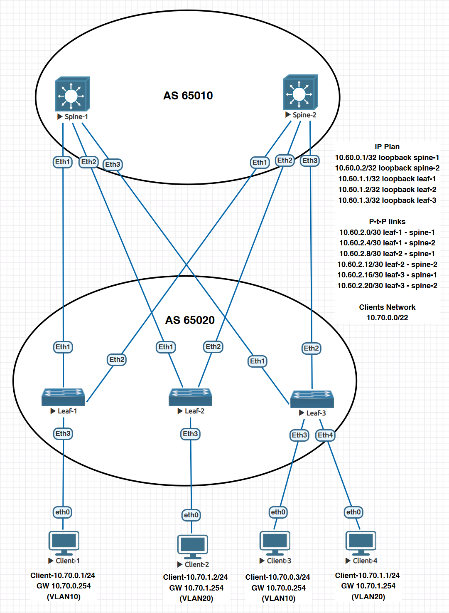

### VxLAN. L2 VNI

### Цели
- Настроить Overlay на основе VxLAN EVPN для L2 связанности между клиентами
- Настроите BGP peering между Leaf и Spine в AF l2vpn evpn;
- Настроите связанность между клиентами в первой зоне и убедитесь в её наличии;
- Зафиксируете в документации - план работы, адресное пространство, схему сети, конфигурацию устройств;


### Общая топология




### BGP-соседство между Leaf и Spine
- Переделаем связи с iBGP на eBGP.
- Добавим VLAN + svi.
- Настроим клиентов для проверки связи.

#### Настройка Spine-1

```
router bgp 65010
   router-id 10.60.0.1
   timers bgp 3 9
   maximum-paths 10
   bgp listen range 10.60.1.0/24 peer-group LEAF_PEER remote-as 65020
   neighbor LEAF_PEER peer group
   neighbor LEAF_PEER next-hop-unchanged
   neighbor LEAF_PEER update-source Loopback0
   neighbor LEAF_PEER bfd
   neighbor LEAF_PEER ebgp-multihop 5
   neighbor LEAF_PEER route-reflector-client
   neighbor LEAF_PEER send-community extended
   neighbor LEAF_PEER maximum-routes 12000
   !
   address-family evpn
      neighbor LEAF_PEER activate

```

#### Настройка Spine-2

```
router bgp 65010
   router-id 10.60.0.2
   timers bgp 3 9
   maximum-paths 10
   bgp listen range 10.60.1.0/24 peer-group LEAF_PEER remote-as 65020
   neighbor LEAF_PEER peer group
   neighbor LEAF_PEER next-hop-unchanged
   neighbor LEAF_PEER update-source Loopback0
   neighbor LEAF_PEER bfd
   neighbor LEAF_PEER ebgp-multihop 5
   neighbor LEAF_PEER route-reflector-client
   neighbor LEAF_PEER send-community extended
   neighbor LEAF_PEER maximum-routes 12000
   !
   address-family evpn
      neighbor LEAF_PEER activate

```

#### Настройка Leaf-1 + Clinet-1

```
vlan 10,20

interface Vlan10
   ip address 10.70.0.250/24
!
interface Vlan20
   ip address 10.70.1.250/24

interface Ethernet3
   switchport access vlan 10

router bgp 65020
   router-id 10.60.1.1
   timers bgp 3 9
   neighbor SPINE_PEER peer group
   neighbor SPINE_PEER remote-as 65010
   neighbor SPINE_PEER update-source Loopback0
   neighbor SPINE_PEER bfd
   neighbor SPINE_PEER ebgp-multihop 2
   neighbor SPINE_PEER send-community extended
   neighbor 10.60.0.1 peer group SPINE_PEER
   neighbor 10.60.0.2 peer group SPINE_PEER
   redistribute connected route-map REDIST_CONNECTED
   !
   address-family evpn
      neighbor SPINE_PEER activate

interface Vxlan1
vxlan source-interface Loopback0
vxlan udp-port 4789 
vxlan vlan 10 vni 1010
vxlan vlan 20 vni 1020
vxlan flood vtep add 10.60.1.2
vxlan flood vtep add 10.60.1.3


Client-1> show ip

NAME        : Client-1[1]
IP/MASK     : 10.70.0.1/24
GATEWAY     : 10.70.0.254
DNS         :
MAC         : 00:50:79:66:68:06
```

#### Настройка Leaf-2 + Client-2

```
service routing protocols model multi-agent

vlan 10,20
interface Ethernet3
   switchport access vlan 20
interface Vlan10
   ip address 10.70.0.251/24
!
interface Vlan20
   ip address 10.70.1.251/24
!


router bgp 65020
   router-id 10.60.1.2
   timers bgp 3 9
   neighbor SPINE_PEER peer group
   neighbor SPINE_PEER remote-as 65010
   neighbor SPINE_PEER update-source Loopback0
   neighbor SPINE_PEER bfd
   neighbor SPINE_PEER ebgp-multihop 2
   neighbor SPINE_PEER send-community extended
   neighbor 10.60.0.1 peer group SPINE_PEER
   neighbor 10.60.0.2 peer group SPINE_PEER
   redistribute connected route-map REDIST_CONNECTED
   !
   address-family evpn
      neighbor SPINE_PEER activate

interface Vxlan1
vxlan source-interface Loopback0
vxlan udp-port 4789 
vxlan vlan 10 vni 1010
vxlan vlan 20 vni 1020
vxlan flood vtep add 10.60.1.1
vxlan flood vtep add 10.60.1.3

Client-2> show ip

NAME        : Client-2[1]
IP/MASK     : 10.70.1.2/24
GATEWAY     : 10.70.1.254
DNS         :
MAC         : 00:50:79:66:68:07

```

#### Настройка Leaf-3 + Client-3 + Client-4

```
vlan 10,20

interface Ethernet3
   switchport access vlan 10
!
interface Ethernet4
   switchport access vlan 20

interface Vlan10
   ip address 10.70.0.252/24
!
interface Vlan20
   ip address 10.70.1.252/24


router bgp 65020
   router-id 10.60.1.3
   timers bgp 3 9
   neighbor SPINE_PEER peer group
   neighbor SPINE_PEER remote-as 65010
   neighbor SPINE_PEER update-source Loopback0
   neighbor SPINE_PEER bfd
   neighbor SPINE_PEER ebgp-multihop 2
   neighbor SPINE_PEER send-community extended
   neighbor 10.60.0.1 peer group SPINE_PEER
   neighbor 10.60.0.2 peer group SPINE_PEER
   redistribute connected route-map REDIST_CONNECTED
   !
   address-family evpn
      neighbor SPINE_PEER activate

interface Vxlan1
vxlan source-interface Loopback0
vxlan udp-port 4789 
vxlan vlan 10 vni 1010
vxlan vlan 20 vni 1020
vxlan flood vtep add 10.60.1.1
vxlan flood vtep add 10.60.1.2

Client-3> show ip

NAME        : Client-3[1]
IP/MASK     : 10.70.0.3/24
GATEWAY     : 10.70.0.254
DNS         :
MAC         : 00:50:79:66:68:09

Client-4> show ip

NAME        : Client-4[1]
IP/MASK     : 10.70.1.1/24
GATEWAY     : 10.70.1.254
DNS         :
MAC         : 00:50:79:66:68:08
```


#### Проверка конфигурации

```
Client-1> ping 10.70.0.3

84 bytes from 10.70.0.3 icmp_seq=1 ttl=64 time=19.547 ms
84 bytes from 10.70.0.3 icmp_seq=2 ttl=64 time=28.724 ms
84 bytes from 10.70.0.3 icmp_seq=3 ttl=64 time=34.109 ms
84 bytes from 10.70.0.3 icmp_seq=4 ttl=64 time=27.239 ms
84 bytes from 10.70.0.3 icmp_seq=5 ttl=64 time=40.041 ms

Client-2> ping 10.70.1.1

84 bytes from 10.70.1.1 icmp_seq=1 ttl=64 time=23.079 ms
84 bytes from 10.70.1.1 icmp_seq=2 ttl=64 time=34.472 ms
84 bytes from 10.70.1.1 icmp_seq=3 ttl=64 time=45.130 ms
84 bytes from 10.70.1.1 icmp_seq=4 ttl=64 time=31.141 ms
84 bytes from 10.70.1.1 icmp_seq=5 ttl=64 time=86.020 ms

Client-3> ping 10.70.0.250

84 bytes from 10.70.0.250 icmp_seq=1 ttl=64 time=25.459 ms
84 bytes from 10.70.0.250 icmp_seq=2 ttl=64 time=29.121 ms
84 bytes from 10.70.0.250 icmp_seq=3 ttl=64 time=25.983 ms
84 bytes from 10.70.0.250 icmp_seq=4 ttl=64 time=12.918 ms
84 bytes from 10.70.0.250 icmp_seq=5 ttl=64 time=13.722 ms


Client-4> ping 10.70.1.251

84 bytes from 10.70.1.251 icmp_seq=1 ttl=64 time=15.692 ms
84 bytes from 10.70.1.251 icmp_seq=2 ttl=64 time=27.268 ms
84 bytes from 10.70.1.251 icmp_seq=3 ttl=64 time=15.124 ms
84 bytes from 10.70.1.251 icmp_seq=4 ttl=64 time=48.604 ms
84 bytes from 10.70.1.251 icmp_seq=5 ttl=64 time=35.416 ms

spine-1#sh bgp summary
BGP summary information for VRF default
Router identifier 10.60.0.1, local AS number 65010
Neighbor           AS Session State AFI/SAFI                AFI/SAFI State   NLRI Rcd   NLRI Acc
--------- ----------- ------------- ----------------------- -------------- ---------- ----------
10.60.1.1       65020 Established   IPv4 Unicast            Negotiated              1          1
10.60.1.1       65020 Established   L2VPN EVPN              Negotiated              0          0
10.60.1.2       65020 Established   IPv4 Unicast            Negotiated              1          1
10.60.1.2       65020 Established   L2VPN EVPN              Negotiated              0          0
10.60.1.3       65020 Established   IPv4 Unicast            Negotiated              1          1
10.60.1.3       65020 Established   L2VPN EVPN              Negotiated              0          0
spine-1#


spine-2#sh bgp summary
BGP summary information for VRF default
Router identifier 10.60.0.2, local AS number 65010
Neighbor           AS Session State AFI/SAFI                AFI/SAFI State   NLRI Rcd   NLRI Acc
--------- ----------- ------------- ----------------------- -------------- ---------- ----------
10.60.1.1       65020 Established   IPv4 Unicast            Negotiated              1          1
10.60.1.1       65020 Established   L2VPN EVPN              Negotiated              0          0
10.60.1.2       65020 Established   IPv4 Unicast            Negotiated              1          1
10.60.1.2       65020 Established   L2VPN EVPN              Negotiated              0          0
10.60.1.3       65020 Established   IPv4 Unicast            Negotiated              1          1
10.60.1.3       65020 Established   L2VPN EVPN              Negotiated              0          0
spine-2#


leaf-1#sh bgp summary
BGP summary information for VRF default
Router identifier 10.60.1.1, local AS number 65020
Neighbor           AS Session State AFI/SAFI                AFI/SAFI State   NLRI Rcd   NLRI Acc
--------- ----------- ------------- ----------------------- -------------- ---------- ----------
10.60.0.1       65010 Established   IPv4 Unicast            Negotiated              0          0
10.60.0.1       65010 Established   L2VPN EVPN              Negotiated              0          0
10.60.0.2       65010 Established   IPv4 Unicast            Negotiated              0          0
10.60.0.2       65010 Established   L2VPN EVPN              Negotiated              0          0
leaf-1#
leaf-1#sh vxlan address-table
          Vxlan Mac Address Table
----------------------------------------------------------------------

VLAN  Mac Address     Type      Prt  VTEP             Moves   Last Move
----  -----------     ----      ---  ----             -----   ---------
  10  0050.7966.6809  DYNAMIC   Vx1  10.60.1.3        1       0:02:42 ago
  20  0050.7966.6807  DYNAMIC   Vx1  10.60.1.2        1       0:02:11 ago
  20  0050.7966.6808  DYNAMIC   Vx1  10.60.1.3        1       0:01:00 ago
  20  5000.0015.f4e8  DYNAMIC   Vx1  10.60.1.3        1       0:02:38 ago
Total Remote Mac Addresses for this criterion: 4


leaf-1#sh int vxlan 1
Vxlan1 is up, line protocol is up (connected)
  Hardware is Vxlan
  Source interface is Loopback0 and is active with 10.60.1.1
  Listening on UDP port 4789
  Replication/Flood Mode is headend with Flood List Source: CLI
  Remote MAC learning via Datapath
  VNI mapping to VLANs
  Static VLAN to VNI mapping is
    [10, 1010]        [20, 1020]
  Note: All Dynamic VLANs used by VCS are internal VLANs.
        Use 'show vxlan vni' for details.
  Static VRF to VNI mapping is not configured
  Headend replication flood vtep list is:
    10 10.60.1.2       10.60.1.3
    20 10.60.1.2       10.60.1.3
  Shared Router MAC is 0000.0000.0000


  leaf-2#sh bgp summary
BGP summary information for VRF default
Router identifier 10.60.1.2, local AS number 65020
Neighbor           AS Session State AFI/SAFI                AFI/SAFI State   NLRI Rcd   NLRI Acc
--------- ----------- ------------- ----------------------- -------------- ---------- ----------
10.60.0.1       65010 Established   IPv4 Unicast            Negotiated              0          0
10.60.0.1       65010 Established   L2VPN EVPN              Negotiated              0          0
10.60.0.2       65010 Established   IPv4 Unicast            Negotiated              0          0
10.60.0.2       65010 Established   L2VPN EVPN              Negotiated              0          0
leaf-2#
leaf-2#sh vxlan address-table
          Vxlan Mac Address Table
----------------------------------------------------------------------

VLAN  Mac Address     Type      Prt  VTEP             Moves   Last Move
----  -----------     ----      ---  ----             -----   ---------
  10  0050.7966.6806  DYNAMIC   Vx1  10.60.1.1        1       0:03:12 ago
  10  0050.7966.6809  DYNAMIC   Vx1  10.60.1.3        1       0:02:01 ago
  20  0050.7966.6808  DYNAMIC   Vx1  10.60.1.3        1       0:02:41 ago
  20  5000.0015.f4e8  DYNAMIC   Vx1  10.60.1.3        1       0:03:07 ago
Total Remote Mac Addresses for this criterion: 4

leaf-2#sh int vxlan 1
Vxlan1 is up, line protocol is up (connected)
  Hardware is Vxlan
  Source interface is Loopback0 and is active with 10.60.1.2
  Listening on UDP port 4789
  Replication/Flood Mode is headend with Flood List Source: CLI
  Remote MAC learning via Datapath
  VNI mapping to VLANs
  Static VLAN to VNI mapping is
    [10, 1010]        [20, 1020]
  Note: All Dynamic VLANs used by VCS are internal VLANs.
        Use 'show vxlan vni' for details.
  Static VRF to VNI mapping is not configured
  Headend replication flood vtep list is:
    10 10.60.1.1       10.60.1.3
    20 10.60.1.1       10.60.1.3
  Shared Router MAC is 0000.0000.0000


  leaf-3#sh bgp summary
BGP summary information for VRF default
Router identifier 10.60.1.3, local AS number 65020
Neighbor           AS Session State AFI/SAFI                AFI/SAFI State   NLRI Rcd   NLRI Acc
--------- ----------- ------------- ----------------------- -------------- ---------- ----------
10.60.0.1       65010 Established   IPv4 Unicast            Negotiated              0          0
10.60.0.1       65010 Established   L2VPN EVPN              Negotiated              0          0
10.60.0.2       65010 Established   IPv4 Unicast            Negotiated              0          0
10.60.0.2       65010 Established   L2VPN EVPN              Negotiated              0          0

leaf-3#sh vxlan address-table
          Vxlan Mac Address Table
----------------------------------------------------------------------

VLAN  Mac Address     Type      Prt  VTEP             Moves   Last Move
----  -----------     ----      ---  ----             -----   ---------
  10  0050.7966.6806  DYNAMIC   Vx1  10.60.1.1        1       0:03:37 ago
  10  5000.00d5.5dc0  DYNAMIC   Vx1  10.60.1.1        1       0:02:26 ago
  20  0050.7966.6807  DYNAMIC   Vx1  10.60.1.2        1       0:03:06 ago
  20  5000.0003.3766  DYNAMIC   Vx1  10.60.1.2        1       0:01:55 ago
Total Remote Mac Addresses for this criterion: 4

leaf-3#sh int vxlan 1
Vxlan1 is up, line protocol is up (connected)
  Hardware is Vxlan
  Source interface is Loopback0 and is active with 10.60.1.3
  Listening on UDP port 4789
  Replication/Flood Mode is headend with Flood List Source: CLI
  Remote MAC learning via Datapath
  VNI mapping to VLANs
  Static VLAN to VNI mapping is
    [10, 1010]        [20, 1020]
  Note: All Dynamic VLANs used by VCS are internal VLANs.
        Use 'show vxlan vni' for details.
  Static VRF to VNI mapping is not configured
  Headend replication flood vtep list is:
    10 10.60.1.1       10.60.1.2
    20 10.60.1.1       10.60.1.2
  Shared Router MAC is 0000.0000.0000
leaf-3#


```

