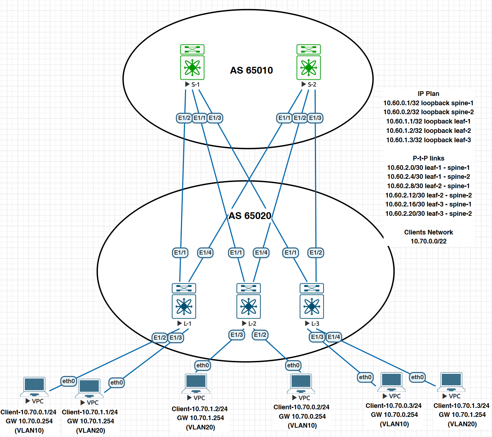

### VxLAN. L3VNI

### Цели
- Настроите каждого клиента в своем VNI
- Настроите маршрутизацию между клиентами.
- Зафиксируете в документации - план работы, адресное пространство, схему сети, конфигурацию устройств;


### Общая топология




### Переходим с Arista на Cisco Nexus
- Перенесем конфигурацию OUnderlay и Overalay из предыдущих заданий.
- Настроим клиентов для проверки связи.

#### Настройка Spine-1

```
hostname SPINE

nv overlay evpn
feature ospf
feature bgp
feature fabric forwarding
feature interface-vlan
feature vn-segment-vlan-based
feature bfd
feature nv overlay

hardware access-list tcam region racl 512
hardware access-list tcam region e-racl 0
hardware access-list tcam region vpc-convergence 256
hardware access-list tcam region arp-ether 256 double-wide

route-map REDISTRIBUTE_CONNECTED permit 10
  match interface loopback0
route-map UNCHANCHED_NH permit 10
  set ip next-hop unchanged
vrf context management

interface Ethernet1/1
  description #To-Leaf-1
  mtu 9216
  bfd interval 100 min_rx 100 multiplier 3
  no bfd echo
  ip address 10.60.2.10/30
  ip ospf network point-to-point
  ip router ospf 10 area 0.0.0.0
  no shutdown

interface Ethernet1/2
  description #To-Leaf-2
  mtu 9216
  bfd interval 100 min_rx 100 multiplier 3
  no bfd echo
  ip address 10.60.2.2/30
  ip ospf network point-to-point
  ip router ospf 10 area 0.0.0.0
  no shutdown

interface Ethernet1/3
  description #To-Leaf-3
  mtu 9216
  bfd interval 100 min_rx 100 multiplier 3
  no bfd echo
  ip address 10.60.2.18/30
  ip ospf network point-to-point
  ip router ospf 10 area 0.0.0.0
  no shutdown

interface loopback0
  ip address 10.60.0.1/32
  ip router ospf 10 area 0.0.0.0

boot nxos bootflash:/nxos64-cs.10.5.2.F.bin
router ospf 10
  log-adjacency-changes

router bgp 65010
  router-id 10.60.0.1
  address-family ipv4 unicast
    redistribute direct route-map REDISTRIBUTE_CONNECTED
  address-family l2vpn evpn
    nexthop route-map UNCHANCHED_NH
    retain route-target all
  template peer LEAF_PEER
    remote-as 65020
    update-source loopback0
    ebgp-multihop 5
    address-family ipv4 unicast
    address-family l2vpn evpn
      disable-peer-as-check
      send-community
      send-community extended
      route-map UNCHANCHED_NH out
  neighbor 10.60.1.1
    inherit peer LEAF_PEER
  neighbor 10.60.1.2
    inherit peer LEAF_PEER
  neighbor 10.60.1.3
    inherit peer LEAF_PEER

```

#### Настройка Spine-2

```
hostname SPINE-2

nv overlay evpn
feature ospf
feature bgp
feature fabric forwarding
feature interface-vlan
feature vn-segment-vlan-based
feature bfd
feature nv overlay

hardware access-list tcam region racl 512
hardware access-list tcam region e-racl 0
hardware access-list tcam region vpc-convergence 256
hardware access-list tcam region arp-ether 256 double-wide

route-map REDISTRIBUTE_CONNECTED permit 10
  match interface loopback0
route-map UNCHANCHED_NH permit 10
  set ip next-hop unchanged
vrf context management

interface Ethernet1/1
  description #To-Leaf-1
  mtu 9216
  bfd interval 100 min_rx 100 multiplier 3
  no bfd echo
  ip address 10.60.2.6/30
  ip ospf network point-to-point
  ip router ospf 10 area 0.0.0.0
  no shutdown

interface Ethernet1/2
  description #To-Leaf-2
  mtu 9216
  bfd interval 100 min_rx 100 multiplier 3
  no bfd echo
  ip address 10.60.2.14/30
  ip ospf network point-to-point
  ip router ospf 10 area 0.0.0.0
  no shutdown

interface Ethernet1/3
  description #To-Leaf-3
  mtu 9216
  bfd interval 100 min_rx 100 multiplier 3
  no bfd echo
  ip address 10.60.2.22/30
  ip ospf network point-to-point
  ip router ospf 10 area 0.0.0.0
  no shutdown


interface loopback0
  ip address 10.60.0.2/32
  ip router ospf 10 area 0.0.0.0

boot nxos bootflash:/nxos64-cs.10.5.2.F.bin
router ospf 10
  log-adjacency-changes
router bgp 65010
  router-id 10.60.0.2
  address-family ipv4 unicast
    redistribute direct route-map REDISTRIBUTE_CONNECTED
  address-family l2vpn evpn
    nexthop route-map UNCHANCHED_NH
    retain route-target all
  template peer LEAF_PEER
    remote-as 65020
    update-source loopback0
    ebgp-multihop 5
    address-family ipv4 unicast
    address-family l2vpn evpn
      disable-peer-as-check
      send-community
      send-community extended
      route-map UNCHANCHED_NH out
  neighbor 10.60.1.1
    inherit peer LEAF_PEER
  neighbor 10.60.1.2
    inherit peer LEAF_PEER
  neighbor 10.60.1.3
    inherit peer LEAF_PEER

```

#### Настройка Leaf-1

```
hostname L-1

nv overlay evpn
feature ospf
feature bgp
feature fabric forwarding
feature interface-vlan
feature vn-segment-vlan-based
feature bfd
feature nv overlay

hardware access-list tcam region racl 512
hardware access-list tcam region e-racl 0
hardware access-list tcam region vpc-convergence 256
hardware access-list tcam region arp-ether 256 double-wide

fabric forwarding anycast-gateway-mac 0000.5e00.0101
vlan 1,10,20,100
vlan 10
  vn-segment 10
vlan 20
  vn-segment 20
vlan 100
  vn-segment 100

ip prefix-list ADVERTISE_OUT seq 5 permit 10.70.0.0/22
route-map ADVERTISE permit 10
  match ip address prefix-list ADVERTISE_OUT
route-map REDISTRIBUTE_CONNECTED permit 10
  match interface loopback0 loopback10
vrf context GREEN
  vni 100
  rd auto
  address-family ipv4 unicast
    route-target both auto
    route-target both auto evpn
vrf context management


interface Vlan10
  no shutdown
  vrf member GREEN
  ip address 10.70.0.254/24
  fabric forwarding mode anycast-gateway

interface Vlan20
  no shutdown
  vrf member GREEN
  ip address 10.70.1.254/24
  fabric forwarding mode anycast-gateway

interface Vlan100
  description #L3VNI
  no shutdown
  mtu 9216
  vrf member GREEN
  ip forward

interface nve1
  no shutdown
  host-reachability protocol bgp
  source-interface loopback0
  member vni 10
    suppress-arp
    ingress-replication protocol bgp
  member vni 20
    suppress-arp
    ingress-replication protocol bgp
  member vni 100 associate-vrf


interface Ethernet1/1
  description #To-Spine-1
  mtu 9216
  bfd interval 100 min_rx 100 multiplier 3
  no bfd echo
  ip address 10.60.2.1/30
  ip ospf network point-to-point
  ip router ospf 10 area 0.0.0.0
  no shutdown

interface Ethernet1/2
  switchport
  switchport access vlan 10
  spanning-tree port type edge

interface Ethernet1/3
  switchport
  switchport access vlan 20
  spanning-tree port type edge
  no shutdown

interface Ethernet1/4
  description #To-Spine-2
  mtu 9216
  bfd interval 100 min_rx 100 multiplier 3
  no bfd echo
  ip address 10.60.2.5/30
  ip ospf network point-to-point
  ip router ospf 10 area 0.0.0.0
  no shutdown

interface loopback0
  ip address 10.60.1.1/32
  ip router ospf 10 area 0.0.0.0


boot nxos bootflash:/nxos64-cs.10.5.2.F.bin
router ospf 10
  router-id 10.60.1.1
  log-adjacency-changes
router bgp 65020
  router-id 10.60.1.1
  timers bgp 3 9
  bestpath as-path multipath-relax
  reconnect-interval 10
  log-neighbor-changes
  address-family ipv4 unicast
    redistribute direct route-map REDISTRIBUTE_CONNECTED
  address-family l2vpn evpn
    maximum-paths 10
  template peer SPINE_PEER
    remote-as 65010
    update-source loopback0
    ebgp-multihop 2
    address-family ipv4 unicast
    address-family l2vpn evpn
      allowas-in 3
      send-community
      send-community extended
  neighbor 10.60.0.1
    inherit peer SPINE_PEER
evpn
  vni 10 l2
    rd auto
    route-target import auto
    route-target export auto
  vni 20 l2
    rd auto
    route-target import auto
    route-target export auto
```

#### Настройка Leaf-2

```
hostname L-2

nv overlay evpn
feature ospf
feature bgp
feature fabric forwarding
feature interface-vlan
feature vn-segment-vlan-based
feature bfd
feature nv overlay

hardware access-list tcam region racl 512
hardware access-list tcam region e-racl 0
hardware access-list tcam region vpc-convergence 256
hardware access-list tcam region arp-ether 256 double-wide


fabric forwarding anycast-gateway-mac 0000.5e00.0101
vlan 1,10,20,100
vlan 10
  vn-segment 10
vlan 20
  vn-segment 20
vlan 100
  vn-segment 100

ip prefix-list ADVERTISE_OUT seq 5 permit 10.70.0.0/22
route-map ADVERTISE permit 10
  match ip address prefix-list ADVERTISE_OUT
route-map REDISTRIBUTE_CONNECTED permit 10
  match interface loopback0 loopback10
vrf context GREEN
  vni 100
  rd auto
  address-family ipv4 unicast
    route-target both auto
    route-target both auto evpn


interface Vlan10
  no shutdown
  vrf member GREEN
  ip address 10.70.0.254/24
  fabric forwarding mode anycast-gateway

interface Vlan20
  no shutdown
  vrf member GREEN
  ip address 10.70.1.254/24
  fabric forwarding mode anycast-gateway

interface Vlan100
  description #L3VNI
  no shutdown
  mtu 9216
  vrf member GREEN
  ip forward

interface nve1
  no shutdown
  host-reachability protocol bgp
  source-interface loopback0
  member vni 10
    suppress-arp
    ingress-replication protocol bgp
  member vni 20
    suppress-arp
    ingress-replication protocol bgp
  member vni 100 associate-vrf

interface Ethernet1/1
  description #To-Spine-1
  mtu 9216
  bfd interval 100 min_rx 100 multiplier 3
  no bfd echo
  ip address 10.60.2.9/30
  ip ospf network point-to-point
  ip router ospf 10 area 0.0.0.0
  no shutdown

interface Ethernet1/2
  switchport
  switchport access vlan 10
  spanning-tree port type edge
  no shutdown

interface Ethernet1/3
  switchport
  switchport access vlan 20
  spanning-tree port type edge
  no shutdown

interface Ethernet1/4
  description #To-Spine-2
  mtu 9216
  bfd interval 100 min_rx 100 multiplier 3
  no bfd echo
  ip address 10.60.2.13/30
  ip ospf network point-to-point
  ip router ospf 10 area 0.0.0.0
  no shutdown

interface loopback0
  ip address 10.60.1.2/32
  ip router ospf 10 area 0.0.0.0

boot nxos bootflash:/nxos64-cs.10.5.2.F.bin

router ospf 10
  router-id 10.60.1.2

router bgp 65020
  router-id 10.60.1.2
  timers bgp 3 9
  bestpath as-path multipath-relax
  reconnect-interval 10
  log-neighbor-changes
  address-family ipv4 unicast
    redistribute direct route-map REDISTRIBUTE_CONNECTED
  address-family l2vpn evpn
    maximum-paths 10
  template peer SPINE_PEER
    remote-as 65010
    update-source loopback0
    ebgp-multihop 2
    address-family ipv4 unicast
    address-family l2vpn evpn
      allowas-in 3
      send-community
      send-community extended
  neighbor 10.60.0.1
    inherit peer SPINE_PEER
evpn
  vni 10 l2
    rd auto
    route-target import auto
    route-target export auto
  vni 20 l2
    rd auto
    route-target import auto
    route-target export auto

```

#### Настройка Leaf-3

```
hostname L-3

nv overlay evpn
feature ospf
feature bgp
feature fabric forwarding
feature interface-vlan
feature vn-segment-vlan-based
feature bfd
feature nv overlay

hardware access-list tcam region racl 512
hardware access-list tcam region e-racl 0
hardware access-list tcam region vpc-convergence 256
hardware access-list tcam region arp-ether 256 double-wide


fabric forwarding anycast-gateway-mac 0000.5e00.0101
vlan 1,10,20,100
vlan 10
  vn-segment 10
vlan 20
  vn-segment 20
vlan 100
  vn-segment 100

ip prefix-list ADVERTISE_OUT seq 5 permit 10.70.0.0/22
route-map ADVERTISE permit 10
  match ip address prefix-list ADVERTISE_OUT
route-map REDISTRIBUTE_CONNECTED permit 10
  match interface loopback0 loopback10
vrf context GREEN
  vni 100
  rd auto
  address-family ipv4 unicast
    route-target both auto
    route-target both auto evpn

interface Vlan10
  no shutdown
  vrf member GREEN
  ip address 10.70.0.254/24
  fabric forwarding mode anycast-gateway

interface Vlan20
  no shutdown
  vrf member GREEN
  ip address 10.70.1.254/24
  fabric forwarding mode anycast-gateway

interface Vlan100
  description #L3VNI
  no shutdown
  mtu 9216
  vrf member GREEN
  ip forward

interface nve1
  no shutdown
  host-reachability protocol bgp
  source-interface loopback0
  member vni 10
    suppress-arp
    ingress-replication protocol bgp
  member vni 20
    suppress-arp
    ingress-replication protocol bgp
  member vni 100 associate-vrf

interface Ethernet1/1
  description #To-Spine-1
  mtu 9216
  bfd interval 100 min_rx 100 multiplier 3
  no bfd echo
  ip address 10.60.2.17/30
  ip ospf network point-to-point
  ip router ospf 10 area 0.0.0.0
  no shutdown

interface Ethernet1/2
  description #To-Spine-2
  mtu 9216
  bfd interval 100 min_rx 100 multiplier 3
  no bfd echo
  ip address 10.60.2.21/30
  ip ospf network point-to-point
  ip router ospf 10 area 0.0.0.0
  no shutdown

interface Ethernet1/3
  switchport
  switchport access vlan 10
  spanning-tree port type edge
  no shutdown

interface Ethernet1/4
  switchport
  switchport access vlan 20
  spanning-tree port type edge
  no shutdown

interface loopback0
  ip address 10.60.1.3/32
  ip router ospf 10 area 0.0.0.0

boot nxos bootflash:/nxos64-cs.10.5.2.F.bin
router ospf 10
  router-id 10.60.1.3
  log-adjacency-changes
router bgp 65020
  router-id 10.60.1.3
  timers bgp 3 9
  bestpath as-path multipath-relax
  reconnect-interval 10
  log-neighbor-changes
  address-family ipv4 unicast
    redistribute direct route-map REDISTRIBUTE_CONNECTED
  address-family l2vpn evpn
    maximum-paths 10
  template peer SPINE_PEER
    remote-as 65010
    update-source loopback0
    ebgp-multihop 2
    address-family ipv4 unicast
    address-family l2vpn evpn
      allowas-in 3
      send-community
      send-community extended
  neighbor 10.60.0.1
    inherit peer SPINE_PEER
  neighbor 10.60.0.2
    inherit peer SPINE_PEER
evpn
  vni 10 l2
    rd auto
    route-target import auto
    route-target export auto
  vni 20 l2
    rd auto
    route-target import auto
    route-target export auto

```


#### Проверка конфигурации

```
L-3#   sh bgp l2vpn evpn sum
BGP summary information for VRF default, address family L2VPN EVPN
BGP router identifier 10.60.1.3, local AS number 65020
BGP table version is 68, L2VPN EVPN config peers 2, capable peers 2
29 network entries and 29 paths using 7452 bytes of memory
BGP attribute entries [28/10304], BGP AS path entries [1/10]
BGP community entries [0/0], BGP clusterlist entries [0/0]

Neighbor        V    AS    MsgRcvd    MsgSent   TblVer  InQ OutQ Up/Down  State/
PfxRcd
10.60.0.1       4 65010        597        583       68    0    0 00:28:48 10

10.60.0.2       4 65010        620        618       68    0    0 00:30:36 0


Neighbor        T    AS Type-1     Type-2     Type-3     Type-4     Type-5     T
ype-12
10.60.0.1       I 65010 0          6          4          0          0          0

10.60.0.2       I 65010 0          0          0          0          0          0

L-3# sh nve peers
Interface Peer-IP                                 State LearnType Uptime   Route
r-Mac
--------- --------------------------------------  ----- --------- -------- -----
------------
nve1      10.60.1.1                               Up    CP        00:28:50 5003.
0000.1b08
nve1      10.60.1.2                               Up    CP        00:28:50 5002.
0000.1b08

L-3# sh bgp l2vpn evpn vni-id 100
BGP routing table information for VRF default, address family L2VPN EVPN
BGP table version is 68, Local Router ID is 10.60.1.3
Status: s-suppressed, x-deleted, S-stale, d-dampened, h-history, *-valid, >-best
Path type: i-internal, e-external, c-confed, l-local, a-aggregate, r-redist, I-i
njected
Origin codes: i - IGP, e - EGP, ? - incomplete, | - multipath, & - backup, 2 - b
est2

   Network            Next Hop            Metric     LocPrf     Weight Path
Route Distinguisher: 10.60.1.3:4    (L3VNI 100)
*>e[2]:[0]:[0]:[48]:[0050.7966.6804]:[32]:[10.70.0.2]/272
                      10.60.1.2                                      0 65010 650
20 i
*>e[2]:[0]:[0]:[48]:[0050.7966.6805]:[32]:[10.70.1.2]/272
                      10.60.1.2                                      0 65010 650
20 i
*>e[2]:[0]:[0]:[48]:[0050.7966.6810]:[32]:[10.70.1.1]/272
                      10.60.1.1                                      0 65010 650
20 i

L-3# sh l2route mac-ip all
Flags -(Rmac):Router MAC (Stt):Static (L):Local (R):Remote
(Dup):Duplicate (Spl):Split (Rcv):Recv(D):Del Pending (S):Stale (C):Clear
(Ps):Peer Sync (Ro):Re-Originated (Orp):Orphan (Asy):Asymmetric (Gw):Gateway
(Bh):Blackhole
(Piporp): Directly connected Orphan to PIP based vPC BGW
(Pipporp): Orphan connected to peer of PIP based vPC BGW
Topology    Mac Address    Host IP                                 Prod   Flags
             Seq No     Next-Hops
----------- -------------- --------------------------------------- ------ ------
----------- ---------- ---------------------------------------------------------
10          0050.7966.6804 10.70.0.2                               BGP    --
             0         10.60.1.2 (Label: 10)
10          0050.7966.6814 10.70.0.3                               HMM    L,
             0         Local
20          0050.7966.6810 10.70.1.1                               BGP    --
             0         10.60.1.1 (Label: 20)
20          0050.7966.6805 10.70.1.2                               BGP    --
             0         10.60.1.2 (Label: 20)
20          0050.7966.6813 10.70.1.3                               HMM    L,
             0         Local
###########################################################################################


L-2# sh bgp l2vpn evpn sum
BGP summary information for VRF default, address family L2VPN EVPN
BGP router identifier 10.60.1.2, local AS number 65020
BGP table version is 65, L2VPN EVPN config peers 1, capable peers 1
29 network entries and 29 paths using 7452 bytes of memory
BGP attribute entries [28/10304], BGP AS path entries [1/10]
BGP community entries [0/0], BGP clusterlist entries [0/0]

Neighbor        V    AS    MsgRcvd    MsgSent   TblVer  InQ OutQ Up/Down  State/
PfxRcd
10.60.0.1       4 65010        837        823       65    0    0 00:40:48 10


Neighbor        T    AS Type-1     Type-2     Type-3     Type-4     Type-5     T
ype-12
10.60.0.1       I 65010 0          6          4          0          0          0

L-2# sh bgp l2vpn evpn vni-id 100
BGP routing table information for VRF default, address family L2VPN EVPN
BGP table version is 65, Local Router ID is 10.60.1.2
Status: s-suppressed, x-deleted, S-stale, d-dampened, h-history, *-valid, >-best
Path type: i-internal, e-external, c-confed, l-local, a-aggregate, r-redist, I-i
njected
Origin codes: i - IGP, e - EGP, ? - incomplete, | - multipath, & - backup, 2 - b
est2

   Network            Next Hop            Metric     LocPrf     Weight Path
Route Distinguisher: 10.60.1.2:4    (L3VNI 100)
*>e[2]:[0]:[0]:[48]:[0050.7966.6810]:[32]:[10.70.1.1]/272
                      10.60.1.1                                      0 65010 650
20 i
*>e[2]:[0]:[0]:[48]:[0050.7966.6813]:[32]:[10.70.1.3]/272
                      10.60.1.3                                      0 65010 650
20 i
*>e[2]:[0]:[0]:[48]:[0050.7966.6814]:[32]:[10.70.0.3]/272
                      10.60.1.3                                      0 65010 650
20 i

L-2# sh nve peers
Interface Peer-IP                                 State LearnType Uptime   Route
r-Mac
--------- --------------------------------------  ----- --------- -------- -----
------------
nve1      10.60.1.1                               Up    CP        00:40:52 5003.
0000.1b08
nve1      10.60.1.3                               Up    CP        00:29:56 5012.
0000.1b08

L-2# sh l2route mac-ip all
Flags -(Rmac):Router MAC (Stt):Static (L):Local (R):Remote
(Dup):Duplicate (Spl):Split (Rcv):Recv(D):Del Pending (S):Stale (C):Clear
(Ps):Peer Sync (Ro):Re-Originated (Orp):Orphan (Asy):Asymmetric (Gw):Gateway
(Bh):Blackhole
(Piporp): Directly connected Orphan to PIP based vPC BGW
(Pipporp): Orphan connected to peer of PIP based vPC BGW
Topology    Mac Address    Host IP                                 Prod   Flags
             Seq No     Next-Hops
----------- -------------- --------------------------------------- ------ ------
----------- ---------- ---------------------------------------------------------
10          0050.7966.6804 10.70.0.2                               HMM    L,
             0         Local
10          0050.7966.6814 10.70.0.3                               BGP    --
             0         10.60.1.3 (Label: 10)
20          0050.7966.6810 10.70.1.1                               BGP    --
             0         10.60.1.1 (Label: 20)
20          0050.7966.6805 10.70.1.2                               HMM    L,
             0         Local
20          0050.7966.6813 10.70.1.3                               BGP    --
             0         10.60.1.3 (Label: 20)
L-2#


###########################################################################################

L-1# sh bgp l2vpn evpn sum
BGP summary information for VRF default, address family L2VPN EVPN
BGP router identifier 10.60.1.1, local AS number 65020
BGP table version is 67, L2VPN EVPN config peers 1, capable peers 1
32 network entries and 32 paths using 8064 bytes of memory
BGP attribute entries [30/11040], BGP AS path entries [1/10]
BGP community entries [0/0], BGP clusterlist entries [0/0]

Neighbor        V    AS    MsgRcvd    MsgSent   TblVer  InQ OutQ Up/Down  State/
PfxRcd
10.60.0.1       4 65010        861        850       67    0    0 00:42:04 12


Neighbor        T    AS Type-1     Type-2     Type-3     Type-4     Type-5     T
ype-12
10.60.0.1       I 65010 0          8          4          0          0          0

L-1# sh bgp l2vpn evpn vni-id 100
BGP routing table information for VRF default, address family L2VPN EVPN
BGP table version is 67, Local Router ID is 10.60.1.1
Status: s-suppressed, x-deleted, S-stale, d-dampened, h-history, *-valid, >-best
Path type: i-internal, e-external, c-confed, l-local, a-aggregate, r-redist, I-i
njected
Origin codes: i - IGP, e - EGP, ? - incomplete, | - multipath, & - backup, 2 - b
est2

   Network            Next Hop            Metric     LocPrf     Weight Path
Route Distinguisher: 10.60.1.1:4    (L3VNI 100)
*>e[2]:[0]:[0]:[48]:[0050.7966.6804]:[32]:[10.70.0.2]/272
                      10.60.1.2                                      0 65010 650
20 i
*>e[2]:[0]:[0]:[48]:[0050.7966.6805]:[32]:[10.70.1.2]/272
                      10.60.1.2                                      0 65010 650
20 i
*>e[2]:[0]:[0]:[48]:[0050.7966.6813]:[32]:[10.70.1.3]/272
                      10.60.1.3                                      0 65010 650
20 i
*>e[2]:[0]:[0]:[48]:[0050.7966.6814]:[32]:[10.70.0.3]/272
                      10.60.1.3                                      0 65010 650
20 i

L-1# sh nve peers
Interface Peer-IP                                 State LearnType Uptime   Route
r-Mac
--------- --------------------------------------  ----- --------- -------- -----
------------
nve1      10.60.1.2                               Up    CP        00:42:10 5002.
0000.1b08
nve1      10.60.1.3                               Up    CP        00:31:15 5012.
0000.1b08

L-1# sh l2route mac-ip all
Flags -(Rmac):Router MAC (Stt):Static (L):Local (R):Remote
(Dup):Duplicate (Spl):Split (Rcv):Recv(D):Del Pending (S):Stale (C):Clear
(Ps):Peer Sync (Ro):Re-Originated (Orp):Orphan (Asy):Asymmetric (Gw):Gateway
(Bh):Blackhole
(Piporp): Directly connected Orphan to PIP based vPC BGW
(Pipporp): Orphan connected to peer of PIP based vPC BGW
Topology    Mac Address    Host IP                                 Prod   Flags
             Seq No     Next-Hops
----------- -------------- --------------------------------------- ------ ------
----------- ---------- ---------------------------------------------------------
10          0050.7966.6804 10.70.0.2                               BGP    --
             0         10.60.1.2 (Label: 10)
10          0050.7966.6814 10.70.0.3                               BGP    --
             0         10.60.1.3 (Label: 10)
20          0050.7966.6810 10.70.1.1                               HMM    L,
             0         Local
20          0050.7966.6805 10.70.1.2                               BGP    --
             0         10.60.1.2 (Label: 20)
20          0050.7966.6813 10.70.1.3                               BGP    --
             0         10.60.1.3 (Label: 20)
L-1#
###########################################################################################


PC_10.70.1.1> ping 10.70.1.254

84 bytes from 10.70.1.254 icmp_seq=1 ttl=255 time=5.420 ms
84 bytes from 10.70.1.254 icmp_seq=2 ttl=255 time=1.184 ms
84 bytes from 10.70.1.254 icmp_seq=3 ttl=255 time=1.421 ms
^C
PC_10.70.1.1> ping 10.70.1.3

84 bytes from 10.70.1.3 icmp_seq=1 ttl=64 time=28.298 ms
84 bytes from 10.70.1.3 icmp_seq=2 ttl=64 time=6.142 ms
84 bytes from 10.70.1.3 icmp_seq=3 ttl=64 time=7.024 ms
^C
PC_10.70.1.1> ping 10.70.1.2

84 bytes from 10.70.1.2 icmp_seq=1 ttl=64 time=12.969 ms
84 bytes from 10.70.1.2 icmp_seq=2 ttl=64 time=7.351 ms
84 bytes from 10.70.1.2 icmp_seq=3 ttl=64 time=28.762 ms
^C
PC_10.70.1.1> ping 10.70.0.2

84 bytes from 10.70.0.2 icmp_seq=1 ttl=62 time=16.587 ms
84 bytes from 10.70.0.2 icmp_seq=2 ttl=62 time=8.631 ms
^C
PC_10.70.1.1> ping 10.70.0.3

84 bytes from 10.70.0.3 icmp_seq=1 ttl=62 time=36.701 ms
84 bytes from 10.70.0.3 icmp_seq=2 ttl=62 time=8.693 ms
^C
PC_10.70.1.1> ping 10.70.0.254

84 bytes from 10.70.0.254 icmp_seq=1 ttl=255 time=1.611 ms
84 bytes from 10.70.0.254 icmp_seq=2 ttl=255 time=1.337 ms
^C
PC_10.70.1.1>


```

