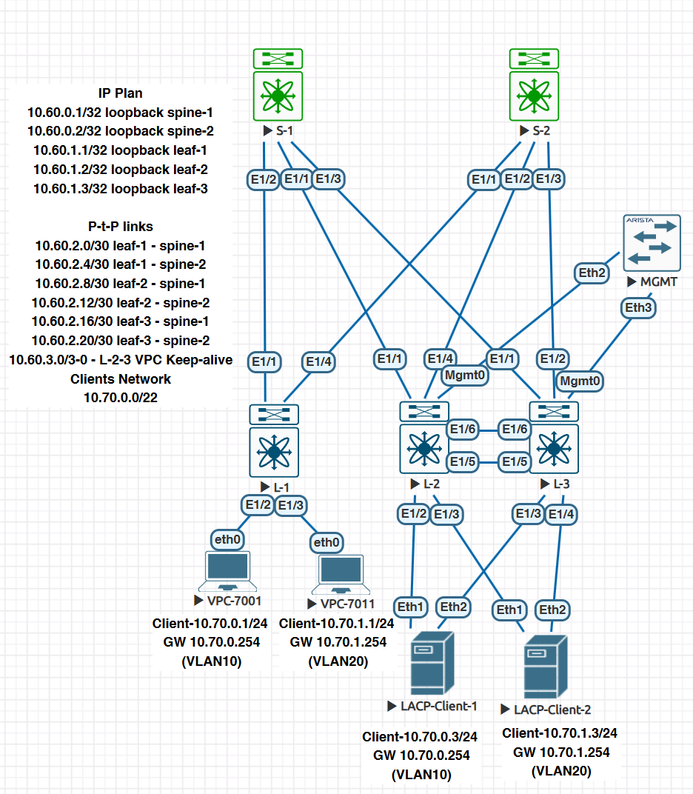
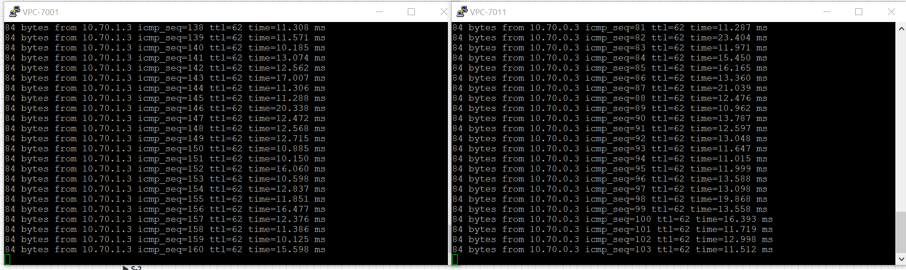

### VXLAN. Multihoming

### Цели
- Настроить отказоустойчивое подключение клиентов с использованием EVPN Multihoming


### Общая топология




### 
- Подключите клиентов 2-я линками к различным Leaf
- Настроите агрегированный канал со стороны клиента
- Настроите multihoming для работы в Overlay сети. Если используете Cisco NXOS - vPC, если иной вендор - то ESI LAG (либо MC-LAG с поддержкой VXLAN)
- Зафиксируете в документации - план работы, адресное пространство, схему сети, конфигурацию устройств

###
Разбор параметров:  


___Конфигурация vPC___ 
Эта конфигурация относится к настройке Virtual Port Channel (vPC) на коммутаторах Cisco. vPC позволяет объединить два коммутатора в логический канал,   обеспечивая отказоустойчивость и балансировку нагрузки.  

Разбор параметров:  
___vpc domain 10___
Устанавливает идентификатор домена vPC. Оба коммутатора в vPC должны иметь одинаковый домен.  

___peer-switch___
Включает режим peer-switch, позволяющий обоим коммутаторам действовать как корневые мосты для протокола Spanning Tree (STP). 
Это ускоряет время восстановления сети.  

___role priority 1___  
Устанавливает приоритет роли для выбора primary-коммутатора в vPC. Чем меньше значение, тем выше приоритет.  

___system-priority 1000___  
Определяет системный приоритет vPC для выбора primary-коммутатора. 
Это значение используется в протоколе LACP. Чем ниже значение, тем выше приоритет.  

___peer-keepalive destination 10.60.3.2___  
Указывает IP-адрес для канала peer-keepalive.   Этот канал проверяет связь между двумя коммутаторами.  

___peer-gateway___  
Активирует функцию peer-gateway, которая позволяет коммутаторам обрабатывать трафик, предназначенный для их партнёра в vPC.   
Это особенно полезно для обработки ARP-запросов от подключённых устройств.  

___layer3 peer-router___  
Включает поддержку Layer 3 маршрутизации через партнёрский коммутатор (peer-router). 
Это полезно для корректной маршрутизации в случае сбоя одного из коммутаторов.  

___auto-recovery reload-delay 60___
Включает автоматическое восстановление vPC после перезагрузки коммутатора. 
Указывает задержку (в секундах) перед восстановлением.  

___delay restore interface-vlan 60___  
Определяет задержку (в секундах) перед восстановлением VLAN-интерфейсов после сбоя vPC.  

___delay restore orphan-port 60___  
Устанавливает задержку (в секундах) перед восстановлением "сиротских" портов (orphan ports) после сбоя vPC. 
Эти порты не участвуют в vPC.  

___fast-convergence___  
Включает ускоренное восстановление vPC при сбое одного из партнёров, минимизируя время простоя.  

Общая цель конфигурации:  
Эти настройки направлены на:  

Обеспечение высокой доступности.  
Ускоренное восстановление после сбоев.  
Минимизацию времени простоя сети.  

#### Настройка Spine-1

```
router bgp 65020
  router-id 10.60.0.1
  address-family l2vpn evpn
  template peer LEAF_PEER
    remote-as 65020
    update-source loopback0
    address-family l2vpn evpn
      send-community
      send-community extended
      route-reflector-client
  neighbor 10.60.1.1
    inherit peer LEAF_PEER
  neighbor 10.60.1.2
    inherit peer LEAF_PEER
  neighbor 10.60.1.3
    inherit peer LEAF_PEER

```

#### Настройка Spine-2

```
router bgp 65020
  router-id 10.60.0.2
  address-family l2vpn evpn
  template peer LEAF_PEER
    remote-as 65020
    update-source loopback0
    address-family l2vpn evpn
      send-community
      send-community extended
      route-reflector-client
  neighbor 10.60.1.1
    inherit peer LEAF_PEER
  neighbor 10.60.1.2
    inherit peer LEAF_PEER
  neighbor 10.60.1.3
    inherit peer LEAF_PEER

```

#### Настройка Leaf-1

```
router bgp 65020
  router-id 10.60.1.1
  timers bgp 3 9
  bestpath as-path multipath-relax
  reconnect-interval 10
  log-neighbor-changes
  address-family l2vpn evpn
    maximum-paths 10
  template peer SPINE_PEER
    remote-as 65020
    update-source loopback0
    address-family l2vpn evpn
      send-community
      send-community extended
  neighbor 10.60.0.1
    inherit peer SPINE_PEER
  neighbor 10.60.0.2
    inherit peer SPINE_PEER
  vrf GREEN
    address-family ipv4 unicast
      redistribute hmm route-map PERMIT-IPv4
      redistribute direct route-map PERMIT-IPv4
```

#### Настройка Leaf-2

```
router bgp 65020
  router-id 10.60.1.2
  timers bgp 3 9
  bestpath as-path multipath-relax
  reconnect-interval 10
  log-neighbor-changes
  address-family l2vpn evpn
    maximum-paths 10
    advertise-pip
  template peer SPINE_PEER
    remote-as 65020
    update-source loopback0
    address-family l2vpn evpn
      send-community
      send-community extended
  neighbor 10.60.0.1
    inherit peer SPINE_PEER
  neighbor 10.60.0.2
    inherit peer SPINE_PEER
  vrf GREEN
    address-family ipv4 unicast
      redistribute hmm route-map PERMIT-IPv4
      redistribute direct route-map PERMIT-IPv4

feature lacp
feature vpc

interface mgmt0
  vrf member management
  ip address 10.60.3.1/30

interface loopback0
  description Loopback for Router ID
  ip address 10.60.1.2/32
  ip address 2.2.2.2/32 secondary
  ip router ospf 10 area 0.0.0.0

vpc domain 10
  peer-switch
  role priority 1
  system-priority 1000
  peer-keepalive destination 10.60.3.2
  peer-gateway
  layer3 peer-router
  auto-recovery reload-delay 60
  delay restore interface-vlan 60
  delay restore orphan-port 60
  fast-convergence

interface nve1
  no shutdown
  host-reachability protocol bgp
  advertise virtual-rmac
  source-interface loopback0
  member vni 10
    suppress-arp
    ingress-replication protocol bgp
  member vni 20
    suppress-arp
    ingress-replication protocol bgp
  member vni 100 associate-vrf

interface port-channel1
  description #LACP-Client-1
  switchport
  switchport mode trunk
  vpc 1

interface port-channel2
  description #LACP-Client-2
  switchport
  switchport mode trunk
  vpc 2

interface port-channel100
  description #MGTM-SW
  switchport
  switchport mode trunk
  spanning-tree port type network
  vpc peer-link

```

#### Настройка Leaf-3

```
router bgp 65020
  router-id 10.60.1.3
  timers bgp 3 9
  bestpath as-path multipath-relax
  reconnect-interval 10
  log-neighbor-changes
  address-family l2vpn evpn
    maximum-paths 10
    advertise-pip
  template peer SPINE_PEER
    remote-as 65020
    update-source loopback0
    address-family l2vpn evpn
      send-community
      send-community extended
  neighbor 10.60.0.1
    inherit peer SPINE_PEER
  neighbor 10.60.0.2
    inherit peer SPINE_PEER
  vrf GREEN
    address-family ipv4 unicast
      redistribute hmm route-map PERMIT-IPv4
      redistribute direct route-map PERMIT-IPv4

feature lacp
feature vpc

interface mgmt0
  vrf member management
  ip address 10.60.3.2/30

interface loopback0
  description Loopback for Router ID
  ip address 10.60.1.3/32
  ip address 2.2.2.2/32 secondary
  ip router ospf 10 area 0.0.0.0

vpc domain 10
  peer-switch
  role priority 1
  system-priority 1000
  peer-keepalive destination 10.60.3.1
  peer-gateway
  layer3 peer-router
  auto-recovery reload-delay 60
  delay restore interface-vlan 60
  delay restore orphan-port 60
  fast-convergence


interface nve1
  no shutdown
  host-reachability protocol bgp
  advertise virtual-rmac
  source-interface loopback0
  member vni 10
    suppress-arp
    ingress-replication protocol bgp
  member vni 20
    suppress-arp
    ingress-replication protocol bgp
  member vni 100 associate-vrf

interface port-channel1
  description #LACP-Client-1
  switchport
  switchport mode trunk
  vpc 1

interface port-channel2
  description #LACP-Client-2
  switchport
  switchport mode trunk
  vpc 2

interface port-channel100
  description #MGTM-SW
  switchport
  switchport mode trunk
  spanning-tree port type network
  vpc peer-link

```
#### Клиенты

```
hostname LACP-Client-1
vlan 10
spanning-tree mode rapid-pvst

interface Port-Channel1
   switchport trunk allowed vlan 10
   switchport mode trunk
!
interface Ethernet1
   channel-group 1 mode active
!
interface Ethernet2
   channel-group 1 mode active

interface Vlan10
   ip address 10.70.0.3/24
ip route 0.0.0.0/0 10.70.0.254


----

hostname LACP-Client-2
vlan 20
spanning-tree mode rapid-pvst

interface Port-Channel1
   switchport trunk allowed vlan 20
   switchport mode trunk
!
interface Ethernet1
   channel-group 1 mode active
!
interface Ethernet2
   channel-group 1 mode active

interface Vlan20
   ip address 10.70.1.3/24

ip route 0.0.0.0/0 10.70.1.254

```

#### Проверка конфигурации

```
L-1# sh nve peers
Interface Peer-IP                                 State LearnType Uptime   Route
r-Mac
--------- --------------------------------------  ----- --------- -------- -----
------------
nve1      2.2.2.2                                 Up    CP        01:07:57 0200.
0202.0202
nve1      10.60.1.2                               Up    CP        00:35:44 5002.
0000.1b08
nve1      10.60.1.3                               Up    CP        01:07:57 5012.
0000.1b08

L-2# sh vpc
Legend:
                (*) - local vPC is down, forwarding via vPC peer-link

vPC domain id                     : 10
Peer status                       : peer adjacency formed ok
vPC keep-alive status             : peer is alive
Configuration consistency status  : success
Per-vlan consistency status       : success
Type-2 consistency status         : success
vPC role                          : primary
Number of vPCs configured         : 2
Peer Gateway                      : Enabled
Dual-active excluded VLANs        : -
Graceful Consistency Check        : Enabled
Auto-recovery status              : Enabled, timer is off.(timeout = 240s)
Delay-restore status              : Timer is off.(timeout = 300s)
Delay-restore SVI status          : Timer is off.(timeout = 300s)
Delay-restore Orphan-port status  : Timer is off.(timeout = 0s)
Operational Layer3 Peer-router    : Enabled
Virtual-peerlink mode             : Disabled

vPC Peer-link status
---------------------------------------------------------------------
id    Port   Status Active vlans
--    ----   ------ -------------------------------------------------
1     Po100  up     1,10,20,100


vPC status
----------------------------------------------------------------------------
Id    Port          Status Consistency Reason                Active vlans
--    ------------  ------ ----------- ------                ---------------
1     Po1           up     success     success               1,10,20,100


2     Po2           up     success     success               1,10,20,100


Please check "show vpc consistency-parameters vpc <vpc-num>" for the
consistency reason of down vpc and for type-2 consistency reasons for
any vpc.

L-2# sh nve peers
Interface Peer-IP                                 State LearnType Uptime   Route
r-Mac
--------- --------------------------------------  ----- --------- -------- -----
------------
nve1      10.60.1.1                               Up    CP        01:10:54 5003.
0000.1b08
nve1      10.60.1.3                               Up    CP        01:11:18 5012.
0000.1b08


L-3# sh vpc
Legend:
                (*) - local vPC is down, forwarding via vPC peer-link

vPC domain id                     : 10
Peer status                       : peer adjacency formed ok
vPC keep-alive status             : peer is alive
Configuration consistency status  : success
Per-vlan consistency status       : success
Type-2 consistency status         : success
vPC role                          : secondary
Number of vPCs configured         : 2
Peer Gateway                      : Enabled
Dual-active excluded VLANs        : -
Graceful Consistency Check        : Enabled
Auto-recovery status              : Enabled, timer is off.(timeout = 240s)
Delay-restore status              : Timer is off.(timeout = 300s)
Delay-restore SVI status          : Timer is off.(timeout = 300s)
Delay-restore Orphan-port status  : Timer is off.(timeout = 0s)
Operational Layer3 Peer-router    : Enabled
Virtual-peerlink mode             : Disabled

vPC Peer-link status
---------------------------------------------------------------------
id    Port   Status Active vlans
--    ----   ------ -------------------------------------------------
1     Po100  up     1,10,20,100


vPC status
----------------------------------------------------------------------------
Id    Port          Status Consistency Reason                Active vlans
--    ------------  ------ ----------- ------                ---------------
1     Po1           up     success     success               1,10,20,100


2     Po2           up     success     success               1,10,20,100


Please check "show vpc consistency-parameters vpc <vpc-num>" for the
consistency reason of down vpc and for type-2 consistency reasons for
any vpc.

L-3# sh nve peers
Interface Peer-IP                                 State LearnType Uptime   Route
r-Mac
--------- --------------------------------------  ----- --------- -------- -----
------------
nve1      10.60.1.1                               Up    CP        01:11:23 5003.
0000.1b08
nve1      10.60.1.2                               Up    CP        00:39:11 5002.
0000.1b08


```

#### Имитация отказа линка

```
PC_10.70.0.1> ping 10.70.1.3 -t
PC_10.70.1.1> ping 10.70.0.3 -t

L-2(config)# int po1
L-2(config-if)# sh
L-2(config-if)# int po2
L-2(config-if)# sh
L-2(config-if)# sh vpc br
Legend:
                (*) - local vPC is down, forwarding via vPC peer-link

vPC domain id                     : 10
Peer status                       : peer adjacency formed ok
vPC keep-alive status             : peer is alive
Configuration consistency status  : success
Per-vlan consistency status       : success
Type-2 consistency status         : success
vPC role                          : primary
Number of vPCs configured         : 2
Peer Gateway                      : Enabled
Dual-active excluded VLANs        : -
Graceful Consistency Check        : Enabled
Auto-recovery status              : Enabled, timer is off.(timeout = 60s)
Delay-restore status              : Timer is off.(timeout = 30s)
Delay-restore SVI status          : Timer is off.(timeout = 60s)
Delay-restore Orphan-port status  : Timer is off.(timeout = 60s)
Operational Layer3 Peer-router    : Enabled
Virtual-peerlink mode             : Disabled

vPC Peer-link status
---------------------------------------------------------------------
id    Port   Status Active vlans
--    ----   ------ -------------------------------------------------
1     Po100  up     1,10,20,100


vPC status
----------------------------------------------------------------------------
Id    Port          Status Consistency Reason                Active vlans
--    ------------  ------ ----------- ------                ---------------
1     Po1           down*  success     success               -


2     Po2           down*  success     success               -


L-3# sh vpc brief
Legend:
                (*) - local vPC is down, forwarding via vPC peer-link

vPC domain id                     : 10
Peer status                       : peer adjacency formed ok
vPC keep-alive status             : peer is alive
Configuration consistency status  : success
Per-vlan consistency status       : success
Type-2 consistency status         : success
vPC role                          : secondary
Number of vPCs configured         : 2
Peer Gateway                      : Enabled
Dual-active excluded VLANs        : -
Graceful Consistency Check        : Enabled
Auto-recovery status              : Enabled, timer is off.(timeout = 60s)
Delay-restore status              : Timer is off.(timeout = 30s)
Delay-restore SVI status          : Timer is off.(timeout = 60s)
Delay-restore Orphan-port status  : Timer is off.(timeout = 60s)
Operational Layer3 Peer-router    : Enabled
Virtual-peerlink mode             : Disabled

vPC Peer-link status
---------------------------------------------------------------------
id    Port   Status Active vlans
--    ----   ------ -------------------------------------------------
1     Po100  up     1,10,20,100


vPC status
----------------------------------------------------------------------------
Id    Port          Status Consistency Reason                Active vlans
--    ------------  ------ ----------- ------                ---------------
1     Po1           up     success     success               1,10,20,100


2     Po2           up     success     success               1,10,20,100


```


