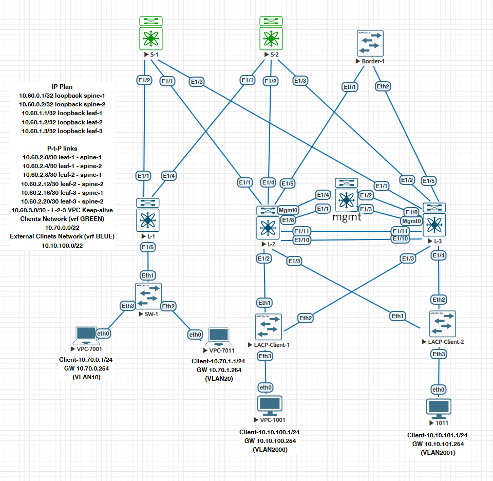
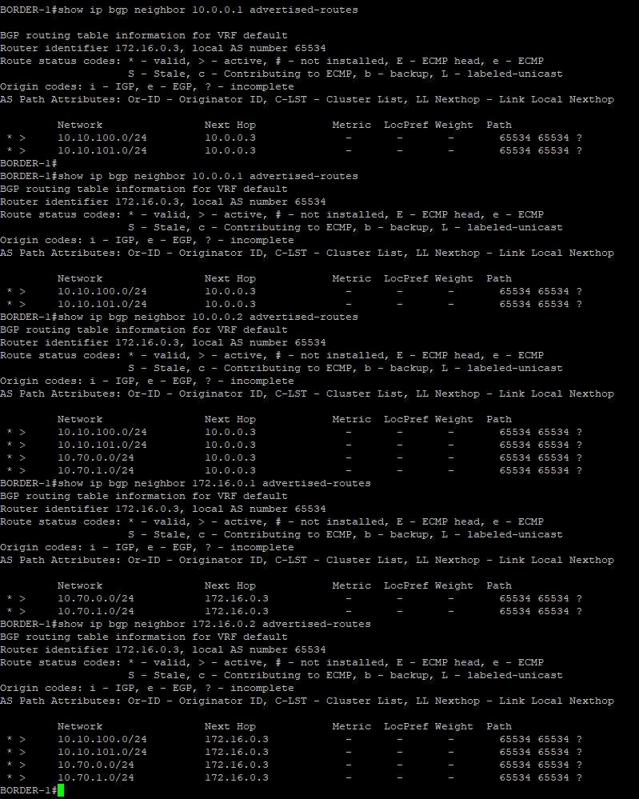
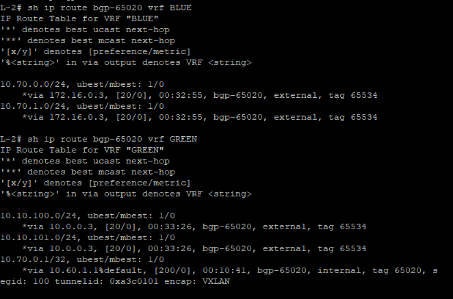
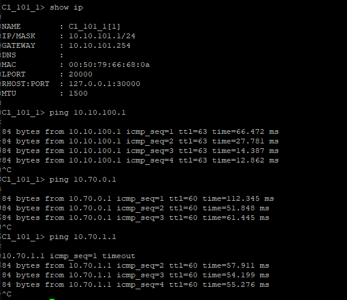

### VxLAN. Routing

### Цели
- Реализовать маршрутизацию между "клиентами" через EVPN route-type 5


### Общая топология




### 
- Разместите двух "клиентов" в разных VRF в рамках одной фабрики. - Создан еще один VRF BLUE
- Настроите маршрутизацию между клиентами через внешнее устройство (граничный роутер\фаерволл\etc) - Добавлен Border-1
- Зафиксируете в документации - план работы, адресное пространство, схему сети, настройки сетевого оборудования


#### Настройка Leaf-1

```
vlan 200
  vn-segment 200
vlan 1000
  vn-segment 1000
vlan 1001
  vn-segment 1001

vrf context BLUE
  vni 200
  rd auto
  address-family ipv4 unicast
    route-target both auto
    route-target both auto evpn

interface Vlan1000
  no shutdown
  vrf member BLUE
  ip address 10.10.100.254/24
  fabric forwarding mode anycast-gateway

interface Vlan1001
  no shutdown
  vrf member BLUE
  ip address 10.10.101.254/24
  fabric forwarding mode anycast-gateway

interface nve1
  member vni 200 associate-vrf
  member vni 1000
    ingress-replication protocol bgp
  member vni 1001
    ingress-replication protocol bgp

router bgp 65020

  vrf BLUE
    address-family ipv4 unicast
      redistribute hmm route-map PERMIT-IPv4
      redistribute direct route-map PERMIT-IPv4
 
```

#### Настройка Leaf-2

```
vlan 400,500
vlan 200
  vn-segment 200
vlan 2000
  vn-segment 2000
vlan 2001
  vn-segment 2001

ip prefix-list BGP-OUT seq 1 deny 0.0.0.0/0 ge 32
ip prefix-list BGP-OUT seq 5 permit 0.0.0.0/0 le 24

vrf context BLUE
  vni 200
  rd auto
  address-family ipv4 unicast
    route-target both auto
    route-target both auto evpn

interface Vlan200
  no shutdown
  vrf member BLUE
  no ip redirects
  ip forward
  no ipv6 redirects

interface Vlan400
  description #To-Border-1 P-t-P
  no shutdown
  vrf member GREEN
  no ip redirects
  ip address 10.0.0.2/29
  no ipv6 redirects

interface Vlan500
  no shutdown
  vrf member BLUE
  no ip redirects
  ip address 172.16.0.2/29
  no ipv6 redirects

interface Vlan2000
  no shutdown
  vrf member BLUE
  no ip redirects
  ip address 10.10.100.254/24
  no ipv6 redirects
  fabric forwarding mode anycast-gateway

interface Vlan2001
  no shutdown
  vrf member BLUE
  no ip redirects
  ip address 10.10.101.254/24
  no ipv6 redirects
  fabric forwarding mode anycast-gateway

interface port-channel1
  description #LACP-Client-1
  switchport
  switchport mode trunk
  switchport trunk allowed vlan 10,20,2000-2001
  vpc 1

interface port-channel2
  description #LACP-Client-2
  switchport
  switchport mode trunk
  switchport trunk allowed vlan 10,20,2000-2001
  vpc 2

interface port-channel50
  description #Border-1
  switchport
  switchport mode trunk
  vpc 50

interface nve1
  no shutdown
  host-reachability protocol bgp
  advertise virtual-rmac
  source-interface loopback0
  member vni 10
    suppress-arp
    ingress-replication protocol bgp
  member vni 20
    suppress-arp
    ingress-replication protocol bgp
  member vni 100 associate-vrf
  member vni 200 associate-vrf
  member vni 2000
    ingress-replication protocol bgp
  member vni 2001
    ingress-replication protocol bgp

router bgp 65020
  
  vrf BLUE
    address-family ipv4 unicast
      redistribute hmm route-map PERMIT-IPv4
      redistribute direct route-map PERMIT-IPv4
    neighbor 172.16.0.3
      remote-as 65534
      address-family ipv4 unicast
        send-community
        send-community extended
        prefix-list BGP-OUT out
  vrf GREEN
    address-family ipv4 unicast
      redistribute hmm route-map PERMIT-IPv4
      redistribute direct route-map PERMIT-IPv4
    neighbor 10.0.0.3
      remote-as 65534
      address-family ipv4 unicast
        send-community
        send-community extended
        prefix-list BGP-OUT out

```

#### Настройка Leaf-3

```
vlan 400,500
vlan 200
  vn-segment 200
vlan 2000
  vn-segment 2000
vlan 2001
  vn-segment 2001

ip prefix-list BGP-OUT seq 1 deny 0.0.0.0/0 ge 32
ip prefix-list BGP-OUT seq 5 permit 0.0.0.0/0 le 24

vrf context BLUE
  vni 200
  rd auto
  address-family ipv4 unicast
    route-target both auto
    route-target both auto evpn

interface Vlan200
  no shutdown
  vrf member BLUE
  no ip redirects
  ip forward
  no ipv6 redirects

interface Vlan400
  description #To-Border-1 P-t-P
  no shutdown
  vrf member GREEN
  no ip redirects
  ip address 10.0.0.1/29
  no ipv6 redirects

interface Vlan500
  no shutdown
  vrf member BLUE
  no ip redirects
  ip address 172.16.0.1/29
  no ipv6 redirects

interface Vlan2000
  no shutdown
  vrf member BLUE
  no ip redirects
  ip address 10.10.100.254/24
  no ipv6 redirects
  fabric forwarding mode anycast-gateway

interface Vlan2001
  no shutdown
  vrf member BLUE
  no ip redirects
  ip address 10.10.101.254/24
  no ipv6 redirects
  fabric forwarding mode anycast-gateway

interface port-channel1
  description #LACP-Client-1
  switchport
  switchport mode trunk
  switchport trunk allowed vlan 10,20,2000-2001
  vpc 1

interface port-channel2
  description #LACP-Client-2
  switchport
  switchport mode trunk
  switchport trunk allowed vlan 10,20,2000-2001
  vpc 2

interface port-channel50
  description #Border-1
  switchport
  switchport mode trunk
  vpc 50

interface nve1
  no shutdown
  host-reachability protocol bgp
  advertise virtual-rmac
  source-interface loopback0
  member vni 10
    suppress-arp
    ingress-replication protocol bgp
  member vni 20
    suppress-arp
    ingress-replication protocol bgp
  member vni 100 associate-vrf
  member vni 200 associate-vrf
  member vni 2000
    ingress-replication protocol bgp
  member vni 2001
    ingress-replication protocol bgp

router bgp 65020
  
  vrf BLUE
    address-family ipv4 unicast
      redistribute hmm route-map PERMIT-IPv4
      redistribute direct route-map PERMIT-IPv4
    neighbor 172.16.0.3
      remote-as 65534
      address-family ipv4 unicast
        send-community
        send-community extended
        prefix-list BGP-OUT out
  vrf GREEN
    address-family ipv4 unicast
      redistribute hmm route-map PERMIT-IPv4
      redistribute direct route-map PERMIT-IPv4
    neighbor 10.0.0.3
      remote-as 65534
      address-family ipv4 unicast
        send-community
        send-community extended
        prefix-list BGP-OUT out


```
#### Border-1

```
hostname Border-1
vlan 400,500
!
interface Port-Channel1
   switchport trunk allowed vlan 400,500
!
interface Port-Channel10
   switchport mode trunk
!
interface Ethernet1
   channel-group 10 mode active
!
interface Ethernet2
   channel-group 10 mode active

interface Vlan400
   ip address 10.0.0.3/29
!
interface Vlan500
   ip address 172.16.0.3/29
!
ip routing
!
route-map MODIFY_ASPATH permit 10
   set as-path match all replacement auto
!
router bgp 65534
   neighbor 10.0.0.1 remote-as 65020
   neighbor 10.0.0.1 route-map MODIFY_ASPATH out
   neighbor 10.0.0.2 remote-as 65020
   neighbor 10.0.0.2 route-map MODIFY_ASPATH out
   neighbor 172.16.0.1 remote-as 65020
   neighbor 172.16.0.1 route-map MODIFY_ASPATH out
   neighbor 172.16.0.2 remote-as 65020
   neighbor 172.16.0.2 route-map MODIFY_ASPATH out

```

#### Проверка конфигурации





