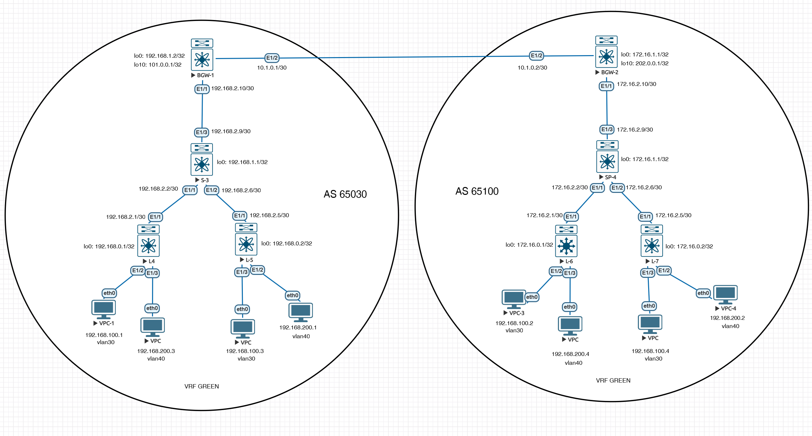

# Проектная работа

## Тема: Проектирование сетевой фабрики на основе VxLAN EVPN с использованием multisite

### Цели:

- Целью данного проекта является проектирование и разработка сетевой фабрики на основе технологии VxLAN EVPN с поддержкой мультиузлов (multisite), состоящей из двух POD. Проект должен обеспечить высокую доступность, масштабируемость и гибкость сети для различных приложений и сервисов компании.


## План:

- Разработка архитектуры сетевой фабрики на основе VxLAN EVPN
- Составление адресного пространства
- Настройка Underlay и Overlay
- Настройка VxLAN туннелей между сайтами и внутри каждого POD.

### [Презентация проекта](assets/presentation.pptx)

### Схема проектируемой сети



### Конфигурация оборудования

#### POD 1
- [BGW-1 (Border Gateway)](configs/BGW-1.conf)
- [L-4 (Leaf node)](configs/L-4.conf)
- [L-5 (Leaf node)](configs/L-5.conf)
- [S-3 (Spine node)](configs/S-3.conf)


#### POD 2
- [BGW-2 (Border Gateway)](configs/BGW-2.conf)
- [L-6 (Leaf node)](configs/L-6.conf)
- [L-7 (Leaf node)](config/L-7.conf)
- [S-4 (Spine node)](config/S-4.conf)


### Проверка (Underlay. POD 1)
```
S-3# sh ip ospf neighbors
 Neighbor ID     Pri State            Up Time  Address         Interface
 192.168.0.1       1 FULL/ -          01:20:18 192.168.2.1     Eth1/1
 192.168.0.2       1 FULL/ -          01:10:11 192.168.2.5     Eth1/2
 10.1.0.1          1 FULL/ -          01:07:04 192.168.2.10    Eth1/3


```
### Проверка (Overlay. POD 1)
```
S-3# sh bgp l2vpn evpn summary
Neighbor        V    AS    MsgRcvd    MsgSent   TblVer  InQ OutQ Up/Down  State/
PfxRcd
192.168.0.1     4 65030        142         97      117    0    0 01:20:12 6

192.168.0.2     4 65030        101         98      117    0    0 01:10:09 4

192.168.1.2     4 65030         91         97      117    0    0 01:06:37 5


Neighbor        T    AS Type-1     Type-2     Type-3     Type-4     Type-5     T
ype-12
192.168.0.1     I 65030 0          4          2          0          0          0

192.168.0.2     I 65030 0          2          2          0          0          0

192.168.1.2     I 65030 0          2          2          1          0          0
```

### Проверка (Route. L-4 POD 1)
```
L-4# sh nve peers
Interface Peer-IP          State LearnType Uptime   Router-Mac
--------- ---------------  ----- --------- -------- -----------------
nve1      101.0.0.1        Up    CP        00:01:22 0200.6500.0001
nve1      192.168.0.2      Up    CP        01:26:43 5000.000c.0007
nve1      192.168.1.2      Up    CP        00:04:48 n/a

```
```
L-4# sh l2route mac-ip all
Flags -(Rmac):Router MAC (Stt):Static (L):Local (R):Remote (V):vPC link
(Dup):Duplicate (Spl):Split (Rcv):Recv(D):Del Pending (S):Stale (C):Clear
(Ps):Peer Sync (Ro):Re-Originated
Topology    Mac Address    Prod   Flags         Seq No     Host IP         Next-
Hops
----------- -------------- ------ ---------- --------------- ---------------
30          0050.7966.6813 HMM    --            0          192.168.100.1  Local
30          0050.7966.6819 BGP    --            0          192.168.100.2  101.0.0.1
30          0050.7966.681c BGP    --            0          192.168.100.3  192.168.0.2
30          0050.7966.681e BGP    --            0          192.168.100.4  101.0.0.1
40          0050.7966.6814 BGP    --            0          192.168.200.1  192.168.0.2
40          0050.7966.681a BGP    --            0          192.168.200.2  101.0.0.1
40          0050.7966.6815 HMM    --            0          192.168.200.3  Local
40          0050.7966.6818 BGP    --            0          192.168.200.4  101.0.0.1

```
```
Leaf-1# sh bgp l2vpn evpn summary
Neighbor        V    AS MsgRcvd MsgSent   TblVer  InQ OutQ Up/Down  State/PfxRcd
10.1.1.0        4 65200     298     249      506    0    0 00:50:29 6
10.2.0.1        4 65202     297     232      506    0    0 00:50:29 11
10.2.1.0        4 65200     113     106      117    0    0 01:34:54 3

Neighbor        T    AS PfxRcd     Type-2     Type-3     Type-4     Type-5
10.1.1.0        I 65200 6          3          2          1          0
10.2.0.1        E 65202 11         9          2          0          0
10.2.1.0        I 65200 3          1          2          0          0

```
```
L-4# sh bgp l2vpn evpn
BGP routing table information for VRF default, address family L2VPN EVPN
BGP table version is 248, Local Router ID is 192.168.0.1
Status: s-suppressed, x-deleted, S-stale, d-dampened, h-history, *-valid, >-best
Path type: i-internal, e-external, c-confed, l-local, a-aggregate, r-redist, I-i
njected
Origin codes: i - IGP, e - EGP, ? - incomplete, | - multipath, & - backup

   Network            Next Hop            Metric     LocPrf     Weight Path
Route Distinguisher: 65030:30
*>i[2]:[0]:[0]:[48]:[0050.7966.6819]:[0]:[0.0.0.0]/216
                      101.0.0.1             2000        100          0 65100 i
*>i[2]:[0]:[0]:[48]:[0050.7966.681e]:[0]:[0.0.0.0]/216
                      101.0.0.1             2000        100          0 65100 i
*>i[2]:[0]:[0]:[48]:[0050.7966.6819]:[32]:[192.168.100.2]/272
                      101.0.0.1             2000        100          0 65100 i
*>i[2]:[0]:[0]:[48]:[0050.7966.681e]:[32]:[192.168.100.4]/272
                      101.0.0.1             2000        100          0 65100 i

Route Distinguisher: 65030:40
*>i[2]:[0]:[0]:[48]:[0050.7966.6818]:[0]:[0.0.0.0]/216
                      101.0.0.1             2000        100          0 65100 i
*>i[2]:[0]:[0]:[48]:[0050.7966.681a]:[0]:[0.0.0.0]/216
                      101.0.0.1             2000        100          0 65100 i
*>i[2]:[0]:[0]:[48]:[0050.7966.6818]:[32]:[192.168.200.4]/272
                      101.0.0.1             2000        100          0 65100 i
*>i[2]:[0]:[0]:[48]:[0050.7966.681a]:[32]:[192.168.200.2]/272
                      101.0.0.1             2000        100          0 65100 i

Route Distinguisher: 192.168.0.1:32797    (L2VNI 30)
*>l[2]:[0]:[0]:[48]:[0050.7966.6813]:[0]:[0.0.0.0]/216
                      192.168.0.1                       100      32768 i
*>i[2]:[0]:[0]:[48]:[0050.7966.6819]:[0]:[0.0.0.0]/216
                      101.0.0.1             2000        100          0 65100 i
*>i[2]:[0]:[0]:[48]:[0050.7966.681c]:[0]:[0.0.0.0]/216
                      192.168.0.2                       100          0 i
*>i[2]:[0]:[0]:[48]:[0050.7966.681e]:[0]:[0.0.0.0]/216
                      101.0.0.1             2000        100          0 65100 i
*>i[2]:[0]:[0]:[48]:[501b.0000.1b08]:[0]:[0.0.0.0]/216
                      192.168.1.2                       100          0 i
*>l[2]:[0]:[0]:[48]:[0050.7966.6813]:[32]:[192.168.100.1]/272
                      192.168.0.1                       100      32768 i
*>i[2]:[0]:[0]:[48]:[0050.7966.6819]:[32]:[192.168.100.2]/272
                      101.0.0.1             2000        100          0 65100 i
*>i[2]:[0]:[0]:[48]:[0050.7966.681c]:[32]:[192.168.100.3]/272
                      192.168.0.2                       100          0 i
*>i[2]:[0]:[0]:[48]:[0050.7966.681e]:[32]:[192.168.100.4]/272
                      101.0.0.1             2000        100          0 65100 i
*>l[3]:[0]:[32]:[192.168.0.1]/88
                      192.168.0.1                       100      32768 i
*>i[3]:[0]:[32]:[192.168.0.2]/88
                      192.168.0.2                       100          0 i
*>i[3]:[0]:[32]:[192.168.1.2]/88
                      192.168.1.2                       100          0 i

Route Distinguisher: 192.168.0.1:32807    (L2VNI 40)
*>i[2]:[0]:[0]:[48]:[0050.7966.6814]:[0]:[0.0.0.0]/216
                      192.168.0.2                       100          0 i
x l[2]:[0]:[0]:[48]:[0050.7966.6815]:[0]:[0.0.0.0]/216
                      192.168.0.1                       100      32768 i
*>i[2]:[0]:[0]:[48]:[0050.7966.6818]:[0]:[0.0.0.0]/216
                      101.0.0.1             2000        100          0 65100 i
*>i[2]:[0]:[0]:[48]:[0050.7966.681a]:[0]:[0.0.0.0]/216
                      101.0.0.1             2000        100          0 65100 i
*>i[2]:[0]:[0]:[48]:[501b.0000.1b08]:[0]:[0.0.0.0]/216
                      192.168.1.2                       100          0 i
*>i[2]:[0]:[0]:[48]:[0050.7966.6814]:[32]:[192.168.200.1]/272
                      192.168.0.2                       100          0 i
*>l[2]:[0]:[0]:[48]:[0050.7966.6815]:[32]:[192.168.200.3]/272
                      192.168.0.1                       100      32768 i
*>i[2]:[0]:[0]:[48]:[0050.7966.6818]:[32]:[192.168.200.4]/272
                      101.0.0.1             2000        100          0 65100 i
*>i[2]:[0]:[0]:[48]:[0050.7966.681a]:[32]:[192.168.200.2]/272
                      101.0.0.1             2000        100          0 65100 i
*>l[3]:[0]:[32]:[192.168.0.1]/88
                      192.168.0.1                       100      32768 i
*>i[3]:[0]:[32]:[192.168.0.2]/88
                      192.168.0.2                       100          0 i
*>i[3]:[0]:[32]:[192.168.1.2]/88
                      192.168.1.2                       100          0 i

Route Distinguisher: 192.168.0.2:32797
*>i[2]:[0]:[0]:[48]:[0050.7966.681c]:[0]:[0.0.0.0]/216
                      192.168.0.2                       100          0 i
*>i[2]:[0]:[0]:[48]:[0050.7966.681c]:[32]:[192.168.100.3]/272
                      192.168.0.2                       100          0 i
*>i[3]:[0]:[32]:[192.168.0.2]/88
                      192.168.0.2                       100          0 i

Route Distinguisher: 192.168.0.2:32807
*>i[2]:[0]:[0]:[48]:[0050.7966.6814]:[0]:[0.0.0.0]/216
                      192.168.0.2                       100          0 i
*>i[2]:[0]:[0]:[48]:[0050.7966.6814]:[32]:[192.168.200.1]/272
                      192.168.0.2                       100          0 i
*>i[3]:[0]:[32]:[192.168.0.2]/88
                      192.168.0.2                       100          0 i

Route Distinguisher: 192.168.1.2:32797
*>i[2]:[0]:[0]:[48]:[501b.0000.1b08]:[0]:[0.0.0.0]/216
                      192.168.1.2                       100          0 i
*>i[3]:[0]:[32]:[192.168.1.2]/88
                      192.168.1.2                       100          0 i

Route Distinguisher: 192.168.1.2:32807
*>i[2]:[0]:[0]:[48]:[501b.0000.1b08]:[0]:[0.0.0.0]/216
                      192.168.1.2                       100          0 i
*>i[3]:[0]:[32]:[192.168.1.2]/88
                      192.168.1.2                       100          0 i

Route Distinguisher: 192.168.0.1:3    (L3VNI 100)
*>i[2]:[0]:[0]:[48]:[0050.7966.6814]:[32]:[192.168.200.1]/272
                      192.168.0.2                       100          0 i
*>i[2]:[0]:[0]:[48]:[0050.7966.6818]:[32]:[192.168.200.4]/272
                      101.0.0.1             2000        100          0 65100 i
*>i[2]:[0]:[0]:[48]:[0050.7966.6819]:[32]:[192.168.100.2]/272
                      101.0.0.1             2000        100          0 65100 i
*>i[2]:[0]:[0]:[48]:[0050.7966.681a]:[32]:[192.168.200.2]/272
                      101.0.0.1             2000        100          0 65100 i
*>i[2]:[0]:[0]:[48]:[0050.7966.681c]:[32]:[192.168.100.3]/272
                      192.168.0.2                       100          0 i
*>i[2]:[0]:[0]:[48]:[0050.7966.681e]:[32]:[192.168.100.4]/272
                      101.0.0.1             2000        100          0 65100 i

L-4#
```
```
L-4# sh ip route vrf GREEN
IP Route Table for VRF "GREEN"
'*' denotes best ucast next-hop
'**' denotes best mcast next-hop
'[x/y]' denotes [preference/metric]
'%<string>' in via output denotes VRF <string>

192.168.100.0/24, ubest/mbest: 1/0, attached
    *via 192.168.100.254, Vlan30, [0/0], 01:49:19, direct
192.168.100.1/32, ubest/mbest: 1/0, attached
    *via 192.168.100.1, Vlan30, [190/0], 01:41:58, hmm
192.168.100.2/32, ubest/mbest: 1/0
    *via 101.0.0.1%default, [200/2000], 00:03:36, bgp-65030, internal, tag 65100
 (evpn) segid: 100 tunnelid: 0x65000001 encap: VXLAN

192.168.100.3/32, ubest/mbest: 1/0
    *via 192.168.0.2%default, [200/0], 01:30:10, bgp-65030, internal, tag 65030
(evpn) segid: 100 tunnelid: 0xc0a80002 encap: VXLAN

192.168.100.4/32, ubest/mbest: 1/0
    *via 101.0.0.1%default, [200/2000], 00:02:46, bgp-65030, internal, tag 65100
 (evpn) segid: 100 tunnelid: 0x65000001 encap: VXLAN

192.168.100.254/32, ubest/mbest: 1/0, attached
    *via 192.168.100.254, Vlan30, [0/0], 01:49:19, local
192.168.200.0/24, ubest/mbest: 1/0, attached
    *via 192.168.200.254, Vlan40, [0/0], 01:49:19, direct
192.168.200.1/32, ubest/mbest: 1/0
    *via 192.168.0.2%default, [200/0], 00:06:14, bgp-65030, internal, tag 65030
(evpn) segid: 100 tunnelid: 0xc0a80002 encap: VXLAN

192.168.200.2/32, ubest/mbest: 1/0
    *via 101.0.0.1%default, [200/2000], 00:10:54, bgp-65030, internal, tag 65100
 (evpn) segid: 100 tunnelid: 0x65000001 encap: VXLAN

192.168.200.3/32, ubest/mbest: 1/0, attached
    *via 192.168.200.3, Vlan40, [190/0], 01:41:13, hmm
192.168.200.4/32, ubest/mbest: 1/0
    *via 101.0.0.1%default, [200/2000], 00:03:14, bgp-65030, internal, tag 65100
 (evpn) segid: 100 tunnelid: 0x65000001 encap: VXLAN

192.168.200.254/32, ubest/mbest: 1/0, attached
    *via 192.168.200.254, Vlan40, [0/0], 01:49:19, local


```

### Проверка (Underlay. POD 2)
```
S-4# sh ip ospf neighbors
 OSPF Process ID 1 VRF default
 Total number of neighbors: 3
 Neighbor ID     Pri State            Up Time  Address         Interface
 172.16.0.1        1 FULL/ -          01:14:41 172.16.2.1      Eth1/1
 172.16.0.2        1 FULL/ -          01:14:38 172.16.2.5      Eth1/2
 10.1.0.2          1 FULL/ -          01:59:32 172.16.2.10     Eth1/3

```

### Проверка (Overlay. POD 2)
```
S-4# sh bgp l2vpn evpn summary

Neighbor        V    AS    MsgRcvd    MsgSent   TblVer  InQ OutQ Up/Down  State/
PfxRcd
172.16.0.1      4 65100        139        167      226    0    0 01:14:28 6

172.16.0.2      4 65100        139        167      226    0    0 01:14:24 6

172.16.1.2      4 65100        254        132      226    0    0 01:58:55 13


Neighbor        T    AS Type-1     Type-2     Type-3     Type-4     Type-5     T
ype-12
172.16.0.1      I 65100 0          4          2          0          0          0

172.16.0.2      I 65100 0          4          2          0          0          0

172.16.1.2      I 65100 0          10         2          1          0          0


```

### Проверка (Route. L-6 POD 2)
```
L-6# sh nve peers
Interface Peer-IP                                 State LearnType Uptime   Route
r-Mac
--------- --------------------------------------  ----- --------- -------- -----
------------
nve1      172.16.0.2                              Up    CP        01:14:57 5017.
0000.1b08
nve1      172.16.1.2                              Up    CP        00:27:34 n/a

nve1      202.0.0.1                               Up    CP        00:24:44 0200.
ca00.0001


```
```

L-6# sh l2route mac-ip all
Flags -(Rmac):Router MAC (Stt):Static (L):Local (R):Remote
(Dup):Duplicate (Spl):Split (Rcv):Recv(D):Del Pending (S):Stale (C):Clear
(Ps):Peer Sync (Ro):Re-Originated (Orp):Orphan (Asy):Asymmetric (Gw):Gateway
(Bh):Blackhole
(Piporp): Directly connected Orphan to PIP based vPC BGW
(Pipporp): Orphan connected to peer of PIP based vPC BGW
Topology    Mac Address    Host IP                                 Prod   Flags
             Seq No     Next-Hops
----------- -------------- --------------------------------------- ------ ------
----------- ---------- ---------------------------------------------------------
30          0050.7966.6813 192.168.100.1                           BGP    --
             0         202.0.0.1 (Label: 30)
30          0050.7966.6819 192.168.100.2                           HMM    L,
             0         Local
30          0050.7966.681c 192.168.100.3                           BGP    --
             0         202.0.0.1 (Label: 30)
30          0050.7966.681e 192.168.100.4                           BGP    --
             0         172.16.0.2 (Label: 30)
40          0050.7966.6814 192.168.200.1                           BGP    --
             0         202.0.0.1 (Label: 40)
40          0050.7966.681a 192.168.200.2                           BGP    --
             0         172.16.0.2 (Label: 40)
40          0050.7966.6815 192.168.200.3                           BGP    --
             0         202.0.0.1 (Label: 40)
40          0050.7966.6818 192.168.200.4                           HMM    L,
             0         Local


```

```
 L-6# sh bgp l2vpn evpn summary
BGP summary information for VRF default, address family L2VPN EVPN
BGP router identifier 172.16.0.1, local AS number 65100
BGP table version is 280, L2VPN EVPN config peers 1, capable peers 1
48 network entries and 48 paths using 12096 bytes of memory
BGP attribute entries [38/13984], BGP AS path entries [1/6]
BGP community entries [0/0], BGP clusterlist entries [2/8]

Neighbor        V    AS    MsgRcvd    MsgSent   TblVer  InQ OutQ Up/Down  State/
PfxRcd
172.16.1.1      4 65100        183         80      280    0    0 01:16:24 18


Neighbor        T    AS Type-1     Type-2     Type-3     Type-4     Type-5     T
ype-12
172.16.1.1      I 65100 0          14         4          0          0          0

L-6# sh bgp l2vpn evpn
BGP routing table information for VRF default, address family L2VPN EVPN
BGP table version is 280, Local Router ID is 172.16.0.1
Status: s-suppressed, x-deleted, S-stale, d-dampened, h-history, *-valid, >-best
Path type: i-internal, e-external, c-confed, l-local, a-aggregate, r-redist, I-i
njected
Origin codes: i - IGP, e - EGP, ? - incomplete, | - multipath, & - backup, 2 - b
est2

   Network            Next Hop            Metric     LocPrf     Weight Path
Route Distinguisher: 65100:30
*>i[2]:[0]:[0]:[48]:[0050.7966.6813]:[0]:[0.0.0.0]/216
                      202.0.0.1             2000        100          0 65030 i
*>i[2]:[0]:[0]:[48]:[0050.7966.681c]:[0]:[0.0.0.0]/216
                      202.0.0.1             2000        100          0 65030 i
*>i[2]:[0]:[0]:[48]:[0050.7966.6813]:[32]:[192.168.100.1]/272
                      202.0.0.1             2000        100          0 65030 i
*>i[2]:[0]:[0]:[48]:[0050.7966.681c]:[32]:[192.168.100.3]/272
                      202.0.0.1             2000        100          0 65030 i

Route Distinguisher: 65100:40
*>i[2]:[0]:[0]:[48]:[0050.7966.6814]:[0]:[0.0.0.0]/216
                      202.0.0.1             2000        100          0 65030 i
*>i[2]:[0]:[0]:[48]:[0050.7966.6815]:[0]:[0.0.0.0]/216
                      202.0.0.1             2000        100          0 65030 i
*>i[2]:[0]:[0]:[48]:[0050.7966.6814]:[32]:[192.168.200.1]/272
                      202.0.0.1             2000        100          0 65030 i
*>i[2]:[0]:[0]:[48]:[0050.7966.6815]:[32]:[192.168.200.3]/272
                      202.0.0.1             2000        100          0 65030 i

Route Distinguisher: 172.16.0.1:32797    (L2VNI 30)
*>i[2]:[0]:[0]:[48]:[0050.7966.6813]:[0]:[0.0.0.0]/216
                      202.0.0.1             2000        100          0 65030 i
*>l[2]:[0]:[0]:[48]:[0050.7966.6819]:[0]:[0.0.0.0]/216
                      172.16.0.1                        100      32768 i
*>i[2]:[0]:[0]:[48]:[0050.7966.681c]:[0]:[0.0.0.0]/216
                      202.0.0.1             2000        100          0 65030 i
*>i[2]:[0]:[0]:[48]:[0050.7966.681e]:[0]:[0.0.0.0]/216
                      172.16.0.2                        100          0 i
*>i[2]:[0]:[0]:[48]:[500e.0000.1b08]:[0]:[0.0.0.0]/216
                      172.16.1.2                        100          0 i
*>i[2]:[0]:[0]:[48]:[0050.7966.6813]:[32]:[192.168.100.1]/272
                      202.0.0.1             2000        100          0 65030 i
*>l[2]:[0]:[0]:[48]:[0050.7966.6819]:[32]:[192.168.100.2]/272
                      172.16.0.1                        100      32768 i
*>i[2]:[0]:[0]:[48]:[0050.7966.681c]:[32]:[192.168.100.3]/272
                      202.0.0.1             2000        100          0 65030 i
*>i[2]:[0]:[0]:[48]:[0050.7966.681e]:[32]:[192.168.100.4]/272
                      172.16.0.2                        100          0 i
*>l[3]:[0]:[32]:[172.16.0.1]/88
                      172.16.0.1                        100      32768 i
*>i[3]:[0]:[32]:[172.16.0.2]/88
                      172.16.0.2                        100          0 i
*>i[3]:[0]:[32]:[172.16.1.2]/88
                      172.16.1.2                        100          0 i

Route Distinguisher: 172.16.0.1:32807    (L2VNI 40)
*>i[2]:[0]:[0]:[48]:[0050.7966.6814]:[0]:[0.0.0.0]/216
                      202.0.0.1             2000        100          0 65030 i
*>i[2]:[0]:[0]:[48]:[0050.7966.6815]:[0]:[0.0.0.0]/216
                      202.0.0.1             2000        100          0 65030 i
*>l[2]:[0]:[0]:[48]:[0050.7966.6818]:[0]:[0.0.0.0]/216
                      172.16.0.1                        100      32768 i
*>i[2]:[0]:[0]:[48]:[0050.7966.681a]:[0]:[0.0.0.0]/216
                      172.16.0.2                        100          0 i
*>i[2]:[0]:[0]:[48]:[500e.0000.1b08]:[0]:[0.0.0.0]/216
                      172.16.1.2                        100          0 i
*>i[2]:[0]:[0]:[48]:[0050.7966.6814]:[32]:[192.168.200.1]/272
                      202.0.0.1             2000        100          0 65030 i
*>i[2]:[0]:[0]:[48]:[0050.7966.6815]:[32]:[192.168.200.3]/272
                      202.0.0.1             2000        100          0 65030 i
*>l[2]:[0]:[0]:[48]:[0050.7966.6818]:[32]:[192.168.200.4]/272
                      172.16.0.1                        100      32768 i
*>i[2]:[0]:[0]:[48]:[0050.7966.681a]:[32]:[192.168.200.2]/272
                      172.16.0.2                        100          0 i
*>l[3]:[0]:[32]:[172.16.0.1]/88
                      172.16.0.1                        100      32768 i
*>i[3]:[0]:[32]:[172.16.0.2]/88
                      172.16.0.2                        100          0 i
*>i[3]:[0]:[32]:[172.16.1.2]/88
                      172.16.1.2                        100          0 i

Route Distinguisher: 172.16.0.2:32797
*>i[2]:[0]:[0]:[48]:[0050.7966.681e]:[0]:[0.0.0.0]/216
                      172.16.0.2                        100          0 i
*>i[2]:[0]:[0]:[48]:[0050.7966.681e]:[32]:[192.168.100.4]/272
                      172.16.0.2                        100          0 i
*>i[3]:[0]:[32]:[172.16.0.2]/88
                      172.16.0.2                        100          0 i

Route Distinguisher: 172.16.0.2:32807
*>i[2]:[0]:[0]:[48]:[0050.7966.681a]:[0]:[0.0.0.0]/216
                      172.16.0.2                        100          0 i
*>i[2]:[0]:[0]:[48]:[0050.7966.681a]:[32]:[192.168.200.2]/272
                      172.16.0.2                        100          0 i
*>i[3]:[0]:[32]:[172.16.0.2]/88
                      172.16.0.2                        100          0 i

Route Distinguisher: 172.16.1.2:32797
*>i[2]:[0]:[0]:[48]:[500e.0000.1b08]:[0]:[0.0.0.0]/216
                      172.16.1.2                        100          0 i
*>i[3]:[0]:[32]:[172.16.1.2]/88
                      172.16.1.2                        100          0 i

Route Distinguisher: 172.16.1.2:32807
*>i[2]:[0]:[0]:[48]:[500e.0000.1b08]:[0]:[0.0.0.0]/216
                      172.16.1.2                        100          0 i
*>i[3]:[0]:[32]:[172.16.1.2]/88
                      172.16.1.2                        100          0 i

Route Distinguisher: 172.16.0.1:4    (L3VNI 100)
*>i[2]:[0]:[0]:[48]:[0050.7966.6813]:[32]:[192.168.100.1]/272
                      202.0.0.1             2000        100          0 65030 i
*>i[2]:[0]:[0]:[48]:[0050.7966.6814]:[32]:[192.168.200.1]/272
                      202.0.0.1             2000        100          0 65030 i
*>i[2]:[0]:[0]:[48]:[0050.7966.6815]:[32]:[192.168.200.3]/272
                      202.0.0.1             2000        100          0 65030 i
*>i[2]:[0]:[0]:[48]:[0050.7966.681a]:[32]:[192.168.200.2]/272
                      172.16.0.2                        100          0 i
*>i[2]:[0]:[0]:[48]:[0050.7966.681c]:[32]:[192.168.100.3]/272
                      202.0.0.1             2000        100          0 65030 i
*>i[2]:[0]:[0]:[48]:[0050.7966.681e]:[32]:[192.168.100.4]/272
                      172.16.0.2                        100          0 i

L-6
```

